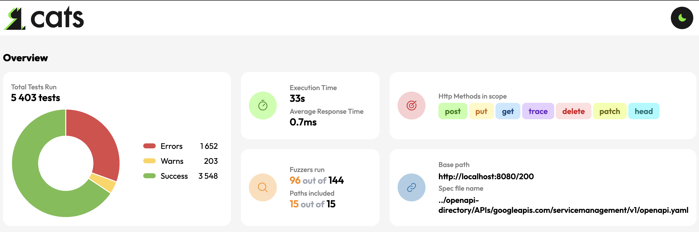

<p align="center">
<picture>
  <source media="(prefers-color-scheme: dark)" srcset="https://raw.githubusercontent.com/Endava/cats/master/images/cats_logo_dark.svg" />
  
</picture>
</p>
<p align="center">


[](https://github.com/Endava/cats/pulse)


[](https://sonarcloud.io/dashboard?id=cats)
[](https://sonarcloud.io/dashboard?id=cats)
[](https://sonarcloud.io/dashboard?id=cats)
[](https://sonarcloud.io/dashboard?id=cats)
[](https://sonarcloud.io/dashboard?id=cats)

</p>

> CATS documentation is available at [https://endava.github.io/cats/](https://endava.github.io/cats/)

**REST API fuzzer and negative testing tool. Run thousands of self-healing API tests within minutes with no coding effort!**

- **Comprehensive**: tests are generated automatically based on a large number scenarios and cover **every** field and header
- **Intelligent**: tests are generated based on data types and constraints; each Fuzzer has specific expectations depending on the scenario under test
- **Highly Configurable**: high amount of customization: you can filter specific Fuzzers, HTTP response codes, HTTP methods, request paths, provide business context and a lot more
- **Self-Healing**: as tests are generated, any OpenAPI spec change is picked up automatically
- **Simple to Learn**: flat learning curve, with intuitive configuration and syntax
- **Fast**: automatic process for write, run and report tests which covers thousands of scenarios within minutes

<p align="center"></p>

> Short on time? Check out the [1-minute Quick Start Guide](https://endava.github.io/cats/docs/intro)!

# Overview
By using a simple and minimal syntax, with a flat learning curve, CATS (**C**ontract **A**PI **T**esting and **S**ecurity) enables you to generate thousands of API tests within minutes with **no coding effort**.
All tests are **generated, run and reported automatically** based on a pre-defined set of **100+ Fuzzers**. 
The Fuzzers cover a wide range of boundary testing and negative scenarios from fully random large Unicode values to well crafted, context dependant values based on the request data types and constraints. 
Even more, you can leverage the fact that CATS generates request payloads dynamically and write simple end-to-end functional tests.

## HTML Report

<div align="center">
  
</div>

## Command Line

<div align="center">
  
</div>

# Tutorials on how to use CATS

This is a list of articles with step-by-step guides on how to use CATS:
* [Testing the GitHub API with CATS](https://ludovicianul.github.io/posts/github-api-testing/)
* [How to write self-healing functional tests with no coding effort](https://ludovicianul.github.io/posts/self-healing-api-tests/)

# Some bugs found by CATS

- https://github.com/hashicorp/vault/issues/13274 | https://github.com/hashicorp/vault/issues/13273
- https://github.com/hashicorp/vault/issues/13225 | https://github.com/hashicorp/vault/issues/13232
- https://github.com/go-gitea/gitea/issues/19397  | https://github.com/go-gitea/gitea/issues/19398
- https://github.com/go-gitea/gitea/issues/19399

# Installation

## Homebrew

```shell
> brew tap endava/tap
> brew install cats
```

## Manual
CATS is bundled both as an executable JAR or a native binary. The native binaries do not need Java installed. 

After downloading your OS native binary, you can add it to PATH so that you can execute it as any other command line tool:

```shell
sudo cp cats /usr/local/bin/cats
```

You can also get autocomplete by downloading the [cats_autocomplete](cats_autocomplete) script and do:

```shell
source cats_autocomplete
```

To get persistent autocomplete, add the above line in `.zshrc` or `.bashrc`, but make sure you put the fully qualified path for the `cats_autocomplete` script.

You can also check the `cats_autocomplete` source for alternative setup.

There is no native binary for Windows, but you can use the uberjar version. This requires Java 21+ to be installed.

You can run it as `java -jar cats.jar`.

Head to the releases page to download the latest version: [https://github.com/Endava/cats/releases](https://github.com/Endava/cats/releases).

## Build from sources

You can build CATS from sources on you local box. You need [Java 21+](https://sdkman.io/jdks). Maven is already bundled.

> Before running the first build, please make sure you do a `./mvnw clean`. CATS uses a fork of [OKHttp](https://square.github.io/okhttp/) which will install locally
under the `4.11.0-CATS` version, so don't worry about overriding the official versions.


You can use the following Maven command to build the project as an uberjar:

`./mvnw package -Dquarkus.package.type=uber-jar`


You will end up with a `cats-runner.jar` in the `target` folder. You can run it with `java -jar cats-runner.jar ...`.

You can also build native images using a [GraalVM Java version](https://www.graalvm.org/).

`./mvnw package -Pnative`

### Notes on Unit Tests

You may see some `error` log messages while running the Unit Tests. Those are expected behaviour for testing the negative scenarios of the Fuzzers.

## Experimental: Maven dependency for programmatic use
CATS doesn't have explicit support (yet) for programmatic use via JUnit or TestNG. 
You can however experiment with running the `CatsMain` class with the same arguments as you would run in the command line.

You must add these 2 dependencies:

```xml
<dependency>
    <groupId>com.squareup.okhttp3</groupId>
    <artifactId>okhttp</artifactId>
    <version>4.11.0</version>
</dependency>
<dependency>
    <groupId>com.endava</groupId>
    <artifactId>cats</artifactId>
    <version>9.0.3</version>
</dependency>
```

> Please not that you also need to explicitly add the `okhttp` dependency. 
> CATS uses a fork of okhttp that is not published in Maven central.
> When using CATS as a dependency, HTTP header fuzzers that prefix/suffix header values with spaces won't properly work.

# Contributing
Please refer to [CONTRIBUTING.md](CONTRIBUTING.md). 
