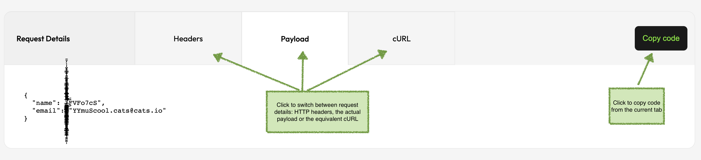

<p align="center">


</p>
<p align="center">


[](https://sonarcloud.io/dashboard?id=cats)
[](https://sonarcloud.io/dashboard?id=cats)
[](https://sonarcloud.io/dashboard?id=cats)
[](https://sonarcloud.io/dashboard?id=cats)
[](https://sonarcloud.io/dashboard?id=cats)

</p>

<h1></h1>

**REST APIs fuzzer and negative testing tool. Run thousands of self-healing API tests within minutes with no coding effort!**

- **Comprehensive**: tests are generated automatically based on a large number scenarios and cover **every** field and header
- **Intelligent**: tests are generated based on data types and constraints; each Fuzzer have specific expectations depending on the scenario under test
- **Highly Configurable**: high amount of customization: you can exclude specific Fuzzers, HTTP response codes, provide business context and a lot more
- **Self-Healing**: as tests are generated, any OpenAPI spec change is picked up automatically
- **Simple to Learn**: flat learning curve, with intuitive configuration and syntax
- **Fast**: automatic process for write, run and report tests which covers thousands of scenarios within minutes

<p align="center"></p>


# Overview
By using a simple and minimal syntax, with a flat learning curve, CATS (**C**ontract **A**uto-generated **T**ests for **S**wagger) enables you to generate thousands of API tests within minutes with **no coding effort**.
All tests are **generated, run and reported automatically** based on a pre-defined set of **89 Fuzzers**. 
The Fuzzers cover a wide range of input data from fully random large Unicode values to well crafted, context dependant values based on the request data types and constraints. 
Even more, you can leverage the fact that CATS generates request payloads dynamically and write simple end-to-end functional tests.

<div align="center">
  
</div>

<h3 align="center" style="color:orange">
Please check the <a href="#slicing-strategies-for-running-cats">Slicing Strategies</a> section for making CATS run fast and comprehensive in the same time.

</h3>

# Tutorials on how to use CATS

This is a list of articles with step-by-step guides on how to use CATS:
* [Testing the GitHub API with CATS](https://ludovicianul.github.io/2020/10/05/github-api-testing/)
* [How to write self-healing functional tests with no coding effort](https://ludovicianul.github.io/2020/09/09/cats/)

# Some bugs found by CATS

- https://github.com/hashicorp/vault/issues/13274
- https://github.com/hashicorp/vault/issues/13273
- https://github.com/hashicorp/vault/issues/13225
- https://github.com/hashicorp/vault/issues/13232

# Installation

CATS is bundled both as an executable JAR or a native binary. The native binaries do not need Java installed. 

After downloading your OS native binary, you can add it in classpath so that you can execute it as any other command line tool:

```shell
sudo cp cats-macos /usr/local/bin/cats
```

You can also get autocomplete by downloading the [cats_autocomplete](cats_autocomplete) script and do:

```shell
source cats_autocomplete
```

To get persistent autocomplete, add the above line in `~/.zshrc` or `./bashrc`, but make sure you put the fully qualified path for the `cats_autocomplete` script.

You can also check the `cats_autocomplete` source for alternative setup.

There is no native binary for Windows, but you can use the uberjar version. This requires Java 11+ to be installed.

You can run it as `java -jar cats.jar`.

Head to the releases page to download the latest versions: [https://github.com/Endava/cats/releases](https://github.com/Endava/cats/releases).

## Build

You can build CATS from sources on you local box. You need Java 11+. Maven is already bundled.

**Before running the first build, please make sure you do a `./mvnw clean`. CATS uses a fork ok `OKHttpClient` which will install locally
under the `4.9.1-CATS` version, so don't worry about overriding the official versions.**

You can use the following Maven command to build the project:

`./mvnw package -Dquarkus.package.type=uber-jar`

`cp target/`

You will end up with a `cats.jar` in the `target` folder. You can run it wih `java -jar cats.jar ...`. 

You can also build native images using a GraalVM Java version. 

`./mvnw package -Pnative`

**Note:** You will need to configure Maven with a [Github PAT](https://docs.github.com/en/free-pro-team@latest/packages/guides/configuring-apache-maven-for-use-with-github-packages) with `read-packages` scope to get some dependencies for the build.

### Notes on Unit Tests

You may see some `ERROR` log messages while running the Unit Tests. Those are expected behaviour for testing the negative scenarios of the `Fuzzers`.

# Running CATS

## Blackbox mode

Blackbox mode means that CATS doesn't need any specific context. You just need to provide the service URL, the OpenAPI spec and most probably [authentication headers](#headers-file).

```shell
> cats --contract=openapy.yaml --server=http://localhost:8080 --headers=headers.yml --blackbox
```

In blackbox mode CATS will only report `ERRORs` if the received HTTP response code is a `5XX`. 
Any other mismatch between what the Fuzzer expects vs what the service returns (for example service returns `400` and service returns `200`) will be ignored.

The blackbox mode is similar to a smoke test. It will quickly tell you if the application has major bugs that must be addressed **immediately**.

## Context mode

The real power of CATS relies on running it in a non-blackbox mode also called context mode. 
Each Fuzzer has an expected HTTP response code based on the scenario under test and will also check if the response is matching the schema defined in the OpenAPI spec specific to that response code.
This will allow you to tweak either your OpenAPI spec or service behaviour in order to create good quality APIs and documentation and also to avoid possible serious bugs.

Running CATS in context mode usually implies providing it a [--refData](#reference-data-file) file with resource identifiers specific to the business logic. 
CATS cannot create data on its own (yet), so it's important that any request field or query param that requires pre-existence of those entities/resources to be created in advance and added to the reference data file.

```shell
> cats --contract=openapy.yaml --server=http://localhost:8080 --headers=headers.yml --refData=referenceData.yml
```

## Notes on skipped Tests
You may notice a significant number of tests marked as `skipped`. CATS will try to apply all `Fuzzers` to all fields, but this is not always possible.
For example the `BooleanFieldsFuzzer` cannot be applied to `String` fields. This is why that test attempt will be marked as skipped.
It was an intentional decision to also report the `skipped` tests in order to show that CATS actually tries all the `Fuzzers` on all the fields/paths/endpoints.


Additionally, CATS support a lot [more arguments](#available-arguments) that allows you to restrict the number of fuzzers, provide timeouts, limit the number of requests per minute and so on.

# Understanding how CATS works and reports results

CATS generates tests based on configured `Fuzzer`s. Each `Fuzzer` has a specific scenario and a specific expected result.
The CATS engine will run the scenario, get the result from the service and match it with the `Fuzzer` expected result.
Depending on the matching outcome, CATS will report as follows:

- `INFO`/`SUCCESS` is expected and documented behaviour. No need for action.
- `WARN` is expected but undocumented behaviour or some misalignment between the contract and the service. This will **ideally** be actioned.
- `ERROR` is abnormal/unexpected behaviour. This **must** be actioned.

CATS will iterate through **all endpoints**, **all HTTP methods** and **all the associated requests bodies and parameters** (including multiple combinations when dealing with `oneOf`/`anyOf` elements) and fuzz their values considering their defined data type and constraints.
The actual fuzzing depends on the specific `Fuzzer` executed. Please see the list of fuzzers and their behaviour.
There are also differences on how the fuzzing works depending on the HTTP method:

- for methods with request bodies like **POST, PUT** the fuzzing will be applied at the **request body data models level**
- for methods without request bodies like **GET, DELETE** the fuzzing will be applied at the **URL parameters level**

This means that for methods with request bodies (`POST,PUT`) that have also URL/path parameters, you need to supply the `path` parameters via [`urlParams`](#url-parameters) or the [`referenceData`](#reference-data-file) file as failure to do so will result in `Illegal character in path at index ...` errors.

# Interpreting Results

CATS produces an execution report in a folder called `cats-report/TIMESTAMP` or `cats-report` depending on the `--timestampReports` argument. The folder will be created inside the current folder (if it doesn't exist) and for each run a new subfolder will be
created with the `TIMESTAMP` value when the run started. This allows you to have a history of the runs. The report itself is in the `index.html` file, where you can:

- filter test runs based on the result: `All`, `Success`, `Warn` and `Error`
- filter based on the `Fuzzer` so that you can only see the runs for that specific `Fuzzer`
- see summary with all the tests with their corresponding path against they were run, and the result
- have ability to click on any tests and get details about the Scenario being executed, Expected Result, Actual result as well as request/response details

Understanding the `Result Reason` values:
- `Unexpected Exception` - reported as `error`; this might indicate a possible bug in the service or a corner case that is not handled correctly by CATS
- `Not Matching Response Schema` - reported as a `warn`; this indicates that the service returns an expected response code and a response body, but the response body does not match the schema defined in the contract
- `Undocumented Response Code` - reported as a `warn`; this indicates that the service returns an expected response code, but the response code is not documented in the contract
- `Unexpected Response Code` - reported as an `error`; this indicates a possible bug in the service - the response code is documented, but is not expected for this scenario
- `Unexpected Behaviour` - reported as an `error`; this indicates a possible bug in the service - the response code is neither documented nor expected for this scenario
- `Not Found` - reported as an `error` in order to force providing more context; this indicates that CATS needs additional business context in order to run successfully - you can do this using the `--refData` and/or `--urlParams` arguments

This is the summary page:


And this is what you get when you click on a specific test:




# Slicing Strategies for Running Cats

CATS has a significant number of `Fuzzers`. Currently, **89** and growing. Some of the `Fuzzers` are executing multiple tests for every given field within the request.
For example the `ControlCharsOnlyInFieldsFuzzer` has **63** control chars values that will be tried for each request field. If a request has 15 fields for example, this will result in **1020 tests**.
Considering that there are additional `Fuzzers` with the same magnitude of tests being generated, you can easily get to 20k tests being executed on a typical run. This will result in huge reports and long run times (i.e. minutes, rather than seconds).

Below are some recommended strategies on how you can separate the tests in chunks which can be executed as stages in a deployment pipeline, one after the other.

## Split by Endpoints
You can use the `--paths=PATH` argument to run CATS sequentially for each path.

## Split by Fuzzer Category
You can use the `--checkXXX` arguments to run CATS only with specific `Fuzzers` like: `--checkHttp`, `-checkFields`, etc.

## Split by Fuzzer Type
You can use various arguments like `--fuzers=Fuzzer1,Fuzzer2` or `-skipFuzzers=Fuzzer1,Fuzzer2` to either include or exclude specific `Fuzzers`. 
For example, you can run all `Fuzzers` except for the `ControlChars` and `Whitespaces` ones like this: `--skipFuzzers=ControlChars,Whitesspaces`. This will skip all Fuzzers containing these strings in their name.
After, you can create an additional run only with these `Fuzzers`: `--fuzzers=ControlChars,Whitespaces`.

These are just some recommendations on how you can split the types of tests cases. Depending on how complex your API is, you might go with a combination of the above or with even more granular splits.

Please note that due to the fact that `ControlChars, Emojis and Whitespaces` generate huge number of tests even for small OpenAPI contracts, they are disabled by default.
You can enable them using the `--includeControlChars`, `--includeWhitespaces` and/or `--includeEmojis` arguments. 
The recommendation is to run them in separate runs so that you get manageable reports and optimal running times.

# Ignoring Specific HTTP Response Codes
By default, CATS will report `WARNs` and `ERRORs` according to the specific behaviour of each Fuzzer. There are cases though when you might want to focus only on critical bugs.
You can use the `--ignoreResponseCodes` argument to supply a list of result codes that should be ignored as issues (overriding the Fuzzer behaviour) and report those cases as success instead or `WARN` or `ERROR`.
For example, if you want CATS to report `ERRORs` only when there is an Exception or the service returns a `500`, you can use this: `--ignoreResultCodes="2xx,4xx"`.

# Ignoring Undocumented Response Code Checks
You can also choose to ignore checks done by the Fuzzers. By default, each Fuzzer has an expected response code, based on the scenario under test and will report and `WARN` the service returns the expected response code, 
but the response code is not documented inside the contract.
You can make CATS ignore the undocumented response code checks (i.e. checking expected response code inside the contract) using the `--ignoreResponseCodeUndocumentedCheck` argument. CATS with now report these cases as `SUCCESS` instead of `WARN`.

# Ignoring Response Body Checks
Additionally, you can also choose to ignore the response body checks. By default, on top of checking the expected response code, each Fuzzer will check if the response body matches what is defined in the contract and will report an `WARN` if not matching.
You can make CATS ignore the response body checks using the `--ingoreResponseBodyCheck` argument. CATS with now report these cases as `SUCCESS` instead of `WARN`.

# Replaying Tests
When CATS runs, for each test, it will export both an HTML file that will be linked in the final report and individual JSON files. The JSON files can be used to replay that test.
When replaying a test (or a list of tests), CATS won't produce any report. The output will be solely available in the console. 
This is useful when you want to see the exact behaviour of the specific test or attach it in a bug report for example.

The syntax for replaying tests is the following:

```shell
> cats replay "Test1,Test233,Test15.json,dir/Test19.json"
```

Some notes on the above example:
- test names can be separated by comma `,`
- if you provide a json extension to a test name, that file will be search as a path i.e. it will search for `Test15.json` in the current folder and `Test19.json` in the `dir` folder
- if you don't provide a json extension to a test name, it will search for that test in the `cats-report` folder i.e. `cats-report/Test1.json` and `cats-report/Test233.json`

# Available Commands

To list all available commands, run CATS with no arguments:

```shell
> cats -h
```

`Other ways to get help from the CATS command are as follows:

- `cats help` or `cats -h` will list all available options

- `cats --version` will display the current CATS version

- `cats list --fuzzers` will list all the existing fuzzers, grouped on categories

- `cats list --fieldsFuzzingStrategy` will list all the available fields fuzzing strategies

- `cats list --paths --contract=CONTRACT` will list all the paths available within the contract

- `cats replay "test1,test2"` will replay the given tests `test1` and `test2`


# Available arguments
- `--contract=LOCATION_OF_THE_CONTRACT` supplies the location of the OpenApi or Swagger contract.
- `--server=URL` supplies the URL of the service implementing the contract.
- `--basicauth=USR:PWD` supplies a `username:password` pair, in case the service uses basic auth.
- `--fuzzers=LIST_OF_FUZZERS` supplies a comma separated list of fuzzers. The supplied list of Fuzzers can be partial names, not full Fuzzer names. CATS which check for all Fuzzers containing the supplied strings. If the argument is not supplied, all fuzzers will be run.
- `--log=PACKAGE:LEVEL` can configure custom log level for a given package. You can provide a comma separated list of packages and levels. This is helpful when you want to see full HTTP traffic: `--log=org.apache.http.wire:debug` or suppress CATS logging: `--log=com.endava.cats:warn`
- `--paths=PATH_LIST` supplies a comma separated list of OpenApi paths to be tested. If no path is supplied, all paths will be considered.
- `--skipPaths=PATH_LIST` a comma separated list of paths to ignore. If no path is supplied, no path will be ignored
- `--fieldsFuzzingStrategy=STRATEGY` specifies which strategy will be used for field fuzzing. Available strategies are `ONEBYONE`, `SIZE` and `POWERSET`. More information on field fuzzing can be found in the sections below.
- `--maxFieldsToRemove=NUMBER` specifies the maximum number of fields to be removed when using the `SIZE` fields fuzzing strategy.
- `--refData=FILE` specifies the file containing static reference data which must be fixed in order to have valid business requests. This is a YAML file. It is explained further in the sections below.
- `--headers=FILE` specifies a file containing headers that will be added when sending payloads to the endpoints. You can use this option to add oauth/JWT tokens for example.
- `--edgeSpacesStrategy=STRATEGY` specifies how to expect the server to behave when sending trailing and prefix spaces within fields. Possible values are `trimAndValidate` and `validateAndTrim`. 
- `--sanitizationStrategy=STRATEGY` specifies how to expect the server to behave when sending Unicode Control Chars and Unicode Other Symbols within the fields. Possible values are `sanitizeAndValidate` and `validateAndSanitize`
- `--urlParams` A comma separated list of 'name:value' pairs of parameters to be replaced inside the URLs. This is useful when you have static parameters in URLs (like 'version' for example).
- `--functionalFuzzerFile` a file used by the `FunctionalFuzzer` that will be used to create user-supplied payloads.
- `--skipFuzzers=LIST_OF_FIZZERs` a comma separated list of fuzzers that will be skipped for **all** paths. You can either provide full `Fuzzer` names (for example: `--skippedFuzzers=VeryLargeStringsFuzzer`) or partial `Fuzzer` names (for example: `--skipFuzzers=VeryLarge`). `CATS` will check if the `Fuzzer` names contains the string you provide in the arguments value.
- `--skipFields=field1,field2#subField1` a comma separated list of fields that will be skipped by replacement Fuzzers like EmptyStringsInFields, NullValuesInFields, etc.
- `--httpMethods=PUT,POST,etc` a comma separated list of HTTP methods that will be used to filter which http methods will be executed for each path within the contract
- `--securityFuzzerFile` A file used by the `SecurityFuzzer` that will be used to inject special strings in order to exploit possible vulnerabilities
- `--printExecutionStatistics` If supplied (no value needed), prints a summary of execution times for each endpoint and HTTP method. By default this will print a summary for each endpoint: max, min and average. If you want detailed reports you must supply `--printExecutionStatistics=detailed`
- `--timestampReports` If supplied (no value needed), it will output the report still inside the `cats-report` folder, but in a sub-folder with the current timestamp
- `--reportFormat=FORMAT` Specifies the format of the CATS report. You can use `htmlOnly` if you want the report to not contain any Javascript. This is useful in CI environments due to Javascript content security policies. Default is `htmlJs` which is the original CATS single page report format.
- `--useExamples` If `true` (default value when not supplied) then CATS will use examples supplied in the OpenAPI contact. If `false` CATS will rely only on generated values
- `--checkFields` If supplied (no value needed), it will only run the Field Fuzzers
- `--checkHeaders` If supplied (no value needed), it will only run the Header Fuzzers
- `--checkHttp` If supplied (no value needed), it will only run the HTTP Fuzzers
- `--checkContract` If supplied (no value needed), it will only run the ContractInfo Fuzzers 
- `--includeWhitespaces` If supplied (no value needed), it will include the Whitespaces Fuzzers 
- `--includeEmojis` If supplied (no value needed), it will include the Emojis Fuzzers 
- `--includeControlChars` If supplied (no value needed), it will include the ControlChars Fuzzers 
- `--sslKeystore` Location of the JKS keystore holding certificates used when authenticating calls using one-way or two-way SSL 
- `--sslKeystorePwd` The password of the `sslKeystore`
- `--sslKeyPwd` The password of the private key from the `sslKeystore`
- `--proxyHost` The proxy server's host name (if running behind proxy)
- `--proxyPort` The proxy server's port number (if running behind proxy)
- `--maxRequestsPerMinute` Maximum number of requests per minute; this is useful when APIs have rate limiting implemented; default is 10000
- `--connectionTimeout` Time period in seconds which CATS should establish a connection with the server; default is 10 seconds
- `--writeTimeout` Maximum time of inactivity in seconds between two data packets when sending the request to the server; default is 10 seconds
- `--readTimeout` Maximum time of inactivity in seconds between two data packets when waiting for the server's response; default is 10 seconds
- `--dryRun` If provided, it will simulate a run of the service with the supplied configuration. The run won't produce a report, but will show how many tests will be generated and run for each OpenAPI endpoint
- `--ignoreResponseCodes` HTTP_CODES_LIST a comma separated list of HTTP response codes that will be considered as SUCCESS, even if the Fuzzer will typically report it as WARN or ERROR. You can use response code families as `2xx`, `4xx`, etc. **If provided, all Contract Fuzzers will be skipped**.
- `--tests` TESTS_LIST a comma separated list of executed tests in JSON format from the cats-report folder. If you supply the list without the .json extension CATS will search the test in the cats-report folder
- `--ignoreResponseCodeUndocumentedCheck` If supplied (not value needed) it won't check if the response code received from the service matches the value expected by the fuzzer and will return the test result as SUCCESS instead of WARN
- `--ignoreResponseBodyCheck` If supplied (not value needed) it won't check if the response body received from the service matches the schema supplied inside the contract and will return the test result as SUCCESS instead of WARN
- `--blackbox` If supplied (no value needed) it will ignore all response codes except for 5XX which will be returned as ERROR. This is similar to `--ignoreResponseCodes="2xx,4xx"`
- `--contentType` A custom mime type if the OpenAPI spec uses content type negotiation versioning.
- `--outoput` The path where the CATS report will be written. Default is `cats-report` in the current directory
- `--skipReportingForIgnoredCodes` Skip reporting entirely for the ignored response codes provided in `--ignoreResponseCodes`

```shell
> cats --contract=my.yml --server=https://locathost:8080 --checkHeaders
```

This will run CATS against `http://localhost:8080` using `my.yml` as an API spec and will only run the HTTP headers `Fuzzers`.

# Available Fuzzers
To get a list of fuzzers run `cats list --fuzzers`. A list of all available fuzzers will be returned, along with a short description for each.

There are multiple categories of `Fuzzers` available:

- `Field Fuzzers` which target request body fields or path parameters
- `Header Fuzzers` which target HTTP headers
- `HTTP Fuzzers` which target just the interaction with the service (without fuzzing fields or headers)

Additional checks which are not actually using any fuzzing, but leverage the CATS internal model of running the tests as `Fuzzers`:

- `ContractInfo Fuzzers` which checks the contract for API good practices
- `Special Fuzzers` a special category which need further configuration and are focused on more complex activities like functional flow, security testing or supplying your own request templates, rather than OpenAPI specs

## Field Fuzzers
`CATS` has currently 42 registered Field `Fuzzers`:
- `BooleanFieldsFuzzer` - iterate through each Boolean field and send random strings in the targeted field
- `DecimalFieldsLeftBoundaryFuzzer` - iterate through each Number field (either float or double) and send requests with outside the range values on the left side in the targeted field
- `DecimalFieldsRightBoundaryFuzzer` - iterate through each Number field (either float or double) and send requests with outside the range values on the right side in the targeted field
- `DecimalValuesInIntegerFieldsFuzzer` - iterate through each Integer field and send requests with decimal values in the targeted field
- `EmptyStringValuesInFieldsFuzzer` - iterate through each field and send requests with empty String values in the targeted field
- `ExtremeNegativeValueDecimalFieldsFuzzer` - iterate through each Number field and send requests with the lowest value possible (-999999999999999999999999999999999999999999.99999999999 for no format, -3.4028235E38 for float and -1.7976931348623157E308 for double) in the targeted field
- `ExtremeNegativeValueIntegerFieldsFuzzer` - iterate through each Integer field and send requests with the lowest value possible (-9223372036854775808 for int32 and -18446744073709551616 for int64) in the targeted field
- `ExtremePositiveValueDecimalFieldsFuzzer` - iterate through each Number field and send requests with the highest value possible (999999999999999999999999999999999999999999.99999999999 for no format, 3.4028235E38 for float and 1.7976931348623157E308 for double) in the targeted field
- `ExtremePositiveValueInIntegerFieldsFuzzer` - iterate through each Integer field and send requests with the highest value possible (9223372036854775807 for int32 and 18446744073709551614 for int64) in the targeted field
- `IntegerFieldsLeftBoundaryFuzzer` - iterate through each Integer field and send requests with outside the range values on the left side in the targeted field
- `IntegerFieldsRightBoundaryFuzzer` - iterate through each Integer field and send requests with outside the range values on the right side in the targeted field
- `InvalidValuesInEnumsFieldsFuzzer` - iterate through each ENUM field and send invalid values
- `LeadingWhitespacesInFieldsTrimValidateFuzzer` - iterate through each field and send requests with Unicode whitespaces and invisible separators prefixing the current value in the targeted field
- `LeadingControlCharsInFieldsTrimValidateFuzzer` - iterate through each field and send requests with Unicode control chars prefixing the current value in the targeted field
- `LeadingSingleCodePointEmojisInFieldsTrimValidateFuzzer` - iterate through each field and send values prefixed with single code points emojis
- `LeadingMultiCodePointEmojisInFieldsTrimValidateFuzzer` - iterate through each field and send values prefixed with multi code points emojis
- `MaxLengthExactValuesInStringFieldsFuzzer` - iterate through each **String** fields that have maxLength declared and send requests with values matching the maxLength size/value in the targeted field
- `MaximumExactValuesInNumericFieldsFuzzer` - iterate through each **Number and Integer** fields that have maximum declared and send requests with values matching the maximum size/value in the targeted field
- `MinLengthExactValuesInStringFieldsFuzzer` - iterate through each **String** fields that have minLength declared and send requests with values matching the minLength size/value in the targeted field
- `MinimumExactValuesInNumericFieldsFuzzer` - iterate through each **Number and Integer** fields that have minimum declared and send requests with values matching the minimum size/value in the targeted field
- `NewFieldsFuzzer` - send a 'happy' flow request and add a new field inside the request called 'catsFuzzyField'
- `NullValuesInFieldsFuzzer` - iterate through each field and send requests with null values in the targeted field
- `OnlyControlCharsInFieldsTrimValidateFuzzer` - iterate through each field and send  values with control chars only
- `OnlyWhitespacesInFieldsTrimValidateFuzzer` - iterate through each field and send  values with unicode separators only
- `OnlySingleCodePointEmojisInFieldsTrimValidateFuzzer` - iterate through each field and send  values with single code point emojis only
- `OnlyMultiCodePointEmojisInFieldsTrimValidateFuzzer` - iterate through each field and send  values with multi code point emojis only
- `RemoveFieldsFuzzer` - iterate through each request fields and remove certain fields according to the supplied 'fieldsFuzzingStrategy'
- `StringFieldsLeftBoundaryFuzzer` - iterate through each String field and send requests with outside the range values on the left side in the targeted field
- `StringFieldsRightBoundaryFuzzer` - iterate through each String field and send requests with outside the range values on the right side in the targeted field
- `StringFormatAlmostValidValuesFuzzer` - iterate through each String field and get its 'format' value (i.e. email, ip, uuid, date, datetime, etc); send requests with values which are almost valid (i.e. email@yhoo. for email, 888.1.1. for ip, etc)  in the targeted field
- `StringFormatTotallyWrongValuesFuzzer` - iterate through each String field and get its 'format' value (i.e. email, ip, uuid, date, datetime, etc); send requests with values which are totally wrong (i.e. abcd for email, 1244. for ip, etc)  in the targeted field
- `StringsInNumericFieldsFuzzer` - iterate through each Integer (int, long) and Number field (float, double) and send requests having the `fuzz` string value in the targeted field
- `TrailingWhitespacesInFieldsTrimValidateFuzzer` - iterate through each field and send requests with trailing with Unicode whitespaces and invisible separators in the targeted field
- `TrailingControlCharsInFieldsTrimValidateFuzzer` - iterate through each field and send requests with trailing with Unicode control chars in the targeted field
- `TrailingSingleCodePointEmojisInFieldsTrimValidateFuzzer` - iterate through each field and send values trailed with single code point emojis
- `TrailingMultiCodePointEmojisInFieldsTrimValidateFuzzer` - iterate through each field and send values trailed with multi code point emojis
- `VeryLargeStringsFuzzer` - iterate through each String field and send requests with very large values (40000 characters) in the targeted field
- `WithinControlCharsInFieldsSanitizeValidateFuzzer` - iterate through each field and send values containing unicode control chars
- `WithinSingleCodePointEmojisInFieldsTrimValidateFuzzer` - iterate through each field and send values containing single code point emojis
- `WithinMultiCodePointEmojisInFieldsTrimValidateFuzzer` - iterate through each field and send values containing multi code point emojis
- `ZalgoTextInStringFieldsValidateSanitizeFuzzer` - iterate through each field and send values containing zalgo text

You can run only these `Fuzzers` by supplying the `--checkFields` argument.

## Header Fuzzers
`CATS` has currently 28 registered Header `Fuzzers`: 
- `AbugidasCharsInHeadersFuzzer` -  iterate through each header and send requests with abugidas chars in the targeted header
- `CheckSecurityHeadersFuzzer` - check all responses for good practices around Security related headers like: [{name=Cache-Control, value=no-store}, {name=X-XSS-Protection, value=1; mode=block}, {name=X-Content-Type-Options, value=nosniff}, {name=X-Frame-Options, value=DENY}]
- `DummyAcceptHeadersFuzzer` - send a request with a dummy Accept header and expect to get 406 code
- `DummyContentTypeHeadersFuzzer` - send a request with a dummy Content-Type header and expect to get 415 code
- `DuplicateHeaderFuzzer` - send a 'happy' flow request and duplicate an existing header
- `EmptyStringValuesInHeadersFuzzer` - iterate through each header and send requests with empty String values in the targeted header
- `ExtraHeaderFuzzer` - send a 'happy' flow request and add an extra field inside the request called 'Cats-Fuzzy-Header'
- `LargeValuesInHeadersFuzzer` - iterate through each header and send requests with large values in the targeted header
- `LeadingControlCharsInHeadersFuzzer` - iterate through each header and prefix values with control chars
- `LeadingWhitespacesInHeadersFuzzer` - iterate through each header and prefix value with unicode separators
- `LeadingSpacesInHeadersFuzzer` - iterate through each header and send requests with spaces prefixing the value in the targeted header
- `RemoveHeadersFuzzer` - iterate through each header and remove different combinations of them
- `OnlyControlCharsInHeadersFuzzer` - iterate through each header and replace value with control chars
- `OnlySpacesInHeadersFuzzer` - iterate through each header and replace value with spaces
- `OnlyWhitespacesInHeadersFuzzer` - iterate through each header and replace value with unicode separators
- `TrailingSpacesInHeadersFuzzer` - iterate through each header and send requests with trailing spaces in the targeted header \
- `TrailingControlCharsInHeadersFuzzer` - iterate through each header and trail values with control chars
- `TrailingWhitespacesInHeadersFuzzer` - iterate through each header and trail values with unicode separators
- `UnsupportedAcceptHeadersFuzzer` - send a request with an unsupported Accept header and expect to get 406 code
- `UnsupportedContentTypesHeadersFuzzer` - send a request with an unsupported Content-Type header and expect to get 415 code
- `ZalgoTextInHeadersFuzzer` - iterate through each header and send requests with zalgo text in the targeted header

You can run only these `Fuzzers` by supplying the `--checkHeaders` argument.

## HTTP Fuzzers
`CATS` has currently 6 registered HTTP `Fuzzers`:
- `BypassAuthenticationFuzzer` - check if an authentication header is supplied; if yes try to make requests without it
- `DummyRequestFuzzer` - send a dummy json request {'cats': 'cats'}
- `HappyFuzzer` - send a request with all fields and headers populated
- `HttpMethodsFuzzer` - iterate through each undocumented HTTP method and send an empty request
- `MalformedJsonFuzzer` - send a malformed json request which has the String 'bla' at the end
- `NonRestHttpMethodsFuzzer` - iterate through a list of HTTP method specific to the WebDav protocol that are not expected to be implemented by REST APIs

You can run only these `Fuzzers` by supplying the `--checkHttp` argument.

## ContractInfo Fuzzers
Usually a good OpenAPI contract must follow several good practices in order to make it easy digestible by the service clients and act as much as possible as self-sufficient documentation:
- follow good practices around naming the contract elements like paths, requests, responses
- always use plural for the path names, separate paths words through hyphens/underscores, use camelCase or snake_case for any `json` types and properties
- provide tags for all operations in order to avoid breaking code generation on some languages and have a logical grouping of the API operations
- provide good description for all paths, methods and request/response elements
- provide meaningful responses for `POST`, `PATCH` and `PUT` requests
- provide examples for all requests/response elements
- provide structural constraints for (ideally) all request/response properties (min, max, regex)
- heaver some sort of `CorrelationIds/TraceIds` within headers
- have at least a security schema in place
- avoid having the API version part of the paths
- document response codes for both "happy" and "unhappy" flows
- avoid using `xml` payload unless there is a really good reason (like documenting an old API for example)
- json types and properties do not use the same naming (like having a `Pet` with a property named `pet`)

`CATS` has currently 9 registered ContractInfo `Fuzzers`:
- `HttpStatusCodeInValidRangeFuzzer` -  verifies that all HTTP response codes are within the range of 100 to 599
- `NamingsContractInfoFuzzer` - verifies that all OpenAPI contract elements follow REST API naming good practices
- `PathTagsContractInfoFuzzer` - verifies that all OpenAPI paths contain tags elements and checks if the tags elements match the ones declared at the top level
- `RecommendedHeadersContractInfoFuzzer` - verifies that all OpenAPI contract paths contain recommended headers like: CorrelationId/TraceId, etc.
- `RecommendedHttpCodesContractInfoFuzzer` - verifies that the current path contains all recommended HTTP response codes for all operations
- `SecuritySchemesContractInfoFuzzer` - verifies if the OpenApi contract contains valid security schemas for all paths, either globally configured or per path
- `TopLevelElementsContractInfoFuzzer` - verifies that all OpenAPI contract level elements are present and provide meaningful information: API description, documentation, title, version, etc.
- `VersionsContractInfoFuzzer` - verifies that a given path doesn't contain versioning information
- `XmlContentTypeContractInfoFuzzer` - verifies that all OpenAPI contract paths responses and requests does not offer `application/xml` as a Content-Type

You can run only these `Fuzzers` by supplying the `--checkContract` argument.

## Special Fuzzers
### FunctionalFuzzer
#### Writing Custom Tests
You can leverage CATS super-powers of self-healing and payload generation in order to write functional tests. 
This is achieved using the so called `FunctionaFuzzer`, which is not a `Fuzzer` per se, but was named as such for consistency.
The functional tests are written in a YAML file using a simple DSL. 
The DSL supports adding identifiers, descriptions, assertions as well as passing variables between tests.
The cool thing is that, by leveraging the fact that CATS generates valid payload, you only need to override values for specific fields. 
The rest of the information will be populated by `CATS` using valid data, just like a 'happy' flow request.

**It's important to note that `reference data` won't get replaced when using the `FunctionalFuzzer`. So if there are reference data fields, you must also supply those in the `FunctionalFuzzer`.**

The `FunctionalFuzzer` will only trigger if a valid `functionalFuzzer.yml` file is supplied. The file has the following syntax:

```yaml
/path:
    testNumber:
        description: Short description of the test
        prop: value
        prop#subprop: value
        prop7:
          - value1
          - value2
          - value3
        oneOfSelection:
          element#type: "Value"
        expectedResponseCode: HTTP_CODE
        httpMethod: HTTP_NETHOD
```

And a typical run will look like: 

```shell
> cats run functionalFuzzer.yml -c contract.yml -s http://localhost:8080
```

This is a description of the elements within the `functionalFuzzer.yml` file:
- you can supply a `description` of the test. This will be set as the `Scenario` description. If you don't supply a `description` the `testNumber` will be used instead.
- you can have multiple tests under the same path: `test1`, `test2`, etc.
- `expectedResponseCode` is mandatory, otherwise the `Fuzzer` will ignore this test. The `expectedResponseCode` tells CATS what to expect from the service when sending this test.
- *at most* one of the properties can have multiple values. When this situation happens, that test will actually become a list of tests one for each of the values supplied. For example in the above example `prop7` has 3 values. This will actually result in 3 tests, one for each value.
- test within the file are executed **in the declared order**. This is why you can have outputs from one test act as inputs for the next one(s) (see the next section for details).
- if the supplied `httpMethod` doesn't exist in the OpenAPI given path, a `warning` will be issued and no test will be executed
- if the supplied `httpMethod` is not a valid HTTP method, a `warning` will be issued and no test will be executed
- if the request payload uses a `oneOf` element to allow multiple request types, you can control which of the possible types the `FunctionalFuzzer` will apply to using the `oneOfSelection` keyword. The value of the `oneOfSelection` keyword must match the fully qualified name of the `discriminator`.
- if no `oneOfSelection` is supplied, and the request payload accepts multiple `oneOf` elements, than a custom test will be created for each type of payload
- the file uses [Json path](https://github.com/json-path/JsonPath) syntax for all the properties you can supply; you can separate elements through `#` as in the example above instead of `.`

#### Dealing with oneOf, anyOf
When you have request payloads which can take multiple object types, you can use the `oneOfSelection` keyword to specify which of the possible object types is required by the `FunctionalFuzzer`.
If you don't provide this element, all combinations will be considered. If you supply a value, **this must be exactly the one used in the `discriminator`.**

#### Correlating Tests
As CATs mostly relies on generated data with small help from some reference data, testing complex business scenarios with the pre-defined `Fuzzers` is not possible. Suppose we have an endpoint that creates data (doing a `POST`), and we want to check its existence (via `GET`).
We need a way to get some identifier from the POST call and send it to the GET call. This is now possible using the `FunctionalFuzzer`.
The `functionalFuzzerFile` can have an `output` entry where you can state a variable name, and its fully qualified name from the response in order to set its value. 
You can then refer the variable using `${variable_name}` from another test in order to use its value. 

Here is an example:
```yaml
/pet:
    test_1:
      description: Create a Pet
      httpMethod: POST
      name: "My Pet"
      expectedResponseCode: 200
      output:
        petId: pet#id
/pet/{id}:
    test_2:
      description: Get a Pet
      id: ${petId}
      expectedResponseCode: 200
```

Suppose the `test_1` execution outputs:

```json
{
  "pet": 
    { 
      "id" : 2
    }
}
```

When executing `test_1` the value of the pet id will be stored in the `petId` variable (value `2`).
When executing `test_2` the `id` parameter will be replaced with the `petId` variable (value `2`) from the previous case.

**Please note: variables are visible across all custom tests; please be careful with the naming as they will get overridden.**

#### Verifying responses
The `FunctionalFuzzer` can verify more than just the `expectedResponseCode`. This is achieved using the `verify` element. This is an extended version of the above `functionalFuzzer.yml` file.  

```yaml
/pet:
    test_1:
      description: Create a Pet
      httpMethod: POST
      name: "My Pet"
      expectedResponseCode: 200
      output:
        petId: pet#id
      verify:
        pet#name: "Baby"
        pet#id: "[0-9]+"
/pet/{id}:
    test_2:
      description: Get a Pet
      id: ${petId}
      expectedResponseCode: 200
```

Considering the above file:
- the `FunctionalFuzzer` will check if the response has the 2 elements `pet#name` and `pet#id` 
- if the elements are found, it will check that the `pet#name` has the `Baby` value and that the `pet#id` is numeric

The following json response will pass `test_1`:
```json
{
  "pet": 
    { 
      "id" : 2,
      "name": "Baby"
    }
}
```

But this one won't (`pet#name` is missing):
```json
{
  "pet": 
    { 
      "id" : 2
    }
}
```

You can also refer to request fields in the `verify` section by using the `${request#..}` qualifier. Using the above example, by having the following `verify` section:

```yaml
/pet:
  test_1:
    description: Create a Pet
    httpMethod: POST
    name: "My Pet"
    expectedResponseCode: 200
    output:
      petId: pet#id
    verify:
      pet#name: "${request#name}"
      pet#id: "[0-9]+"
```

It will verify if the response contains a `pet#name` element and that its value equals `My Pet` as sent in the request.

Some notes:
- `verify` parameters support Java regexes as values
- you can supply more than one parameter to check (as seen above)
- if at least one of the parameters is not present in the response, `CATs` will report an error
- if all parameters are found and have valid values, but the response code is not matched, `CATs` will report a warning
- if all the parameters are found and match their values, and the response code is as expected, `CATs` will report a success

#### Working with additionalProperties in FunctionalFuzzer
You can also set `additionalProperties` fields through the `functionalFuzzerFile` using the same syntax as for [Setting additionalProperties in Reference Data](#setting-additionalproperties).

#### FunctionalFuzzer Reserved keywords
The following keywords are reserved in `FunctionalFuzzer` tests: `output`, `expectedResponseCode`, `httpMethod`, `description`, `oneOfSelection`, `verify`, `additionalProperties`, `topElement` and `mapValues`.

### Security Fuzzer
Although `CATs` is not a security testing tool, you can use it to test basic security scenarios by fuzzing specific fields with different sets of [nasty strings](https://github.com/minimaxir/big-list-of-naughty-strings).
The behaviour is similar to the `FunctionalFuzzer`. You can use the exact same elements for output variables, test correlation, verify responses and so forth, with the addition that you must also specify a `targetFields` and/or `targetFieldTypes` and a `stringsList` element.
A typical `securityFuzzerFile` will look like this:

```yaml
/pet:
    test_1:
      description: Run XSS scenarios
      name: "My Pet"
      expectedResponseCode: 200
      httpMethod: all
      targetFields:
        - pet#id
        - pet#description
      stringsFile: xss.txt
```

And a typical run:

```shell
> cats run securityFuzzerFile.yml -c contract.yml -s http://localhost:8080
```


You can also supply `output`, `httpMethod`, `oneOfSelection` and/or `verify` (with the same behaviour as within the `FunctionalFuzzer`) if they are relevant to your case.

The file uses [Json path](https://github.com/json-path/JsonPath) syntax for all the properties you can supply; you can separate elements through `#` as in the example instead of `.`.

This is what the `SecurityFuzzer` will do after parsing the above `securityFuzzerFile`:
- it will add the fixed value "My Pet" to all the request for the field `name`
- for each field specified in the `targetFields` i.e. `pet#id` and `pet#description` it will create requests for each line from the `xss.txt` file and supply those values in each field
- if you consider the `xss.txt` sample file included in the `CATs` repo, this means that it will send 21 requests targeting `pet#id` and 21 requests targeting `pet#description` i.e. a total of **42 tests**
- for each of these 42 tests, the `SecurityFuzzer` will expect a `200` response code. If another response code is returned, then `CATs` will report the test as `error`.

If you want the above logic to apply to all paths, you can use `all` as the path name:

```yaml
all:
    test_1:
      description: Run XSS scenarios
      name: "My Pet"
      expectedResponseCode: 200
      httpMethod: all
      targetFields:
        - pet#id
        - pet#description
      stringsFile: xss.txt
```

Instead of specifying the field names, you can broader to scope to target certain fields types. For example, if we want to test for XSS in all `string` fields, you can have the following `securityFuzzerFile`:

```yaml
all:
    test_1:
      description: Run XSS scenarios
      name: "My Pet"
      expectedResponseCode: 200
      httpMethod: all
      targetFieldTypes:
        - string
      stringsFile: xss.txt
```


As an idea on how to create security tests, you can split the [nasty strings](https://github.com/minimaxir/big-list-of-naughty-strings) into multiple files of interest in your particular context.
You can have a `sql_injection.txt`, a `xss.txt`, a `command_injection.txt` and so on. For each of these files, you can create a test entry in the `securityFuzzerFile` where you include the fields you think are meaningful for these types of tests.
(It was a deliberate choice (for now) to not include all fields by default.) The `expectedResponseCode` should be tweaked according to your particular context. 
Your service might sanitize data before validation, so might be perfectly valid to expect a `200` or might validate the fields directly, so might be perfectly valid to expect a `400`.
A `500` will usually mean something was not handled properly and might signal a possible bug.

#### Working with additionalProperties in SecurityFuzzer
You can also set `additionalProperties` fields through the `functionalFuzzerFile` using the same syntax as for [Setting additionalProperties in Reference Data](#setting-additionalproperties).

#### SecurityFuzzer Reserved keywords
The following keywords are reserved in `SecurityFuzzer` tests: `output`, `expectedResponseCode`, `httpMethod`, `description`, `verify`, `oneOfSelection`, `targetFields`, `targetFieldTypes`, `stringsFile`, `additionalProperties`, `topElement` and `mapValues`.

## TemplateFuzzer
The `TemplateFuzzer` can be used to fuzz non-OpenAPI endpoints. If the target API does not have an OpenAPI spec available, you can use a request template to run a limited set of fuzzers.
The syntax for running the `TemplateFuzzer` is as follows (very similar to `curl`:

```shell
> cats fuzz -H header=value -X POST -d '{"field1":"value1","field2":"value2","field3":"value3"}' -t "field1,field2,header" -i "2XX,4XX" http://service-url 
```

The command will:
- send a `POST` request to `http://service-url`
- use the `{"field1":"value1","field2":"value2","field3":"value3"}` as a template
- replace one by one `field1,field2,header` with fuzz data and send each request to the service endpoint
- ignore `2XX,4XX` response codes and report an error when the received response code is not in this list

It was a deliberate choice to limit the fields for which the `Fuzzer` will run by supplying them using the `-t` argument. For nested objects, supply fully qualified names: `field.subfield`. 

Headers can also be fuzzed using the same mechanism as the fields.

This `Fuzzer` will send the following type of data:
- null values
- empty values
- zalgo text
- abugidas characters
- large random unicode data
- very large strings (80k characters)
- single and multi code point emojis
- unicode control characters
- unicode separators
- unicode whitespaces

For a full list of options run `> cats fuzz -h`.

You can also supply your own dictionary of data using the `-w file` argument.

HTTP methods with bodies will only be fuzzed at the request payload and headers level.

HTTP methods without bodies will be fuzzed at path and query parameters and headers level. In this case you don't need to supply  a `-d` argument.

This is an example for a `GET` request:

```shell
> cats fuzz -X GET -t "path1,query1" -i "2XX,4XX" http://service-url/paths1?query1=test&query2
```

# Reference Data File
There are often cases where some fields need to contain relevant business values in order for a request to succeed. You can provide such values using a reference data file specified by the `--refData` argument. The reference data file is a YAML-format file that contains specific fixed values for different paths in the request document. The file structure is as follows:

```yaml
/path/0.1/auth:
    prop#subprop: 12
    prop2: 33
    prop3#subprop1#subprop2: "test"
/path/0.1/cancel:
    prop#test: 1
```

For each path you can supply custom values for properties and sub-properties which will have priority over values supplied by any other `Fuzzer`.
Consider this request payload:

```json

{
    "address": {
        "phone": "123",
        "postCode": "408",
        "street": "cool street"    
    },
    "name": "Joe"
}

```

and the following reference data file file:


```yaml
/path/0.1/auth:
    address#street: "My Street"
    name: "John"
```

This will result in any fuzzed request to the `/path/0.1/auth` endpoint being updated to contain the supplied fixed values:

```json

{
    "address": {
        "phone": "123",
        "postCode": "408",
        "street": "My Street"    
    },
    "name": "John"
}
```

The file uses [Json path](https://github.com/json-path/JsonPath) syntax for all the properties you can supply; you can separate elements through `#` as in the example above instead of `.`.

You can use environment (system) variables in a ref data file using: `$$VARIABLE_NAME`. (notice double `$$`)

## Setting additionalProperties
As additional properties are maps i.e. they don't actually have a structure, CATS cannot currently generate valid values. If the elements within such a data structure are essential for a request,
you can supply them via the `refData` file using the following syntax:

```yaml
/path/0.1/auth:
    address#street: "My Street"
    name: "John"
    additionalProperties:
      topElement: metadata
      mapValues:
        test: "value1"
        anotherTest: "value2"
```

The `additionalProperties` element must contain the actual key-value pairs to be sent within the requests and also a top element if needed. `topElement` is not mandatory.
The above example will output the following json (considering also the above examples):
```json

{
    "address": {
        "phone": "123",
        "postCode": "408",
        "street": "My Street"    
    },
    "name": "John",
    "metadata": {
        "test": "value1",
        "anotherTest": "value2"
    }   
}
```
## RefData reserved keywords
The following keywords are reserved in a reference data file: `additionalProperties`, `topElement` and `mapValues`.

## Sending ref data for ALL paths
You can also have the ability to send the same reference data for ALL paths (just like you do with the headers). You can achieve this by using `all` as a key in the `refData` file:

```yaml
all:
  address#zip: 123
```
This will try to replace `address#zip` in **all** requests (if the field is present).

## Removing fields
There are (rare) cases when some fields may not make sense together. Something like: if you send `firstName` and `lastName`, you are not allowed to also send `name`. 
As OpenAPI does not have the capability to send request fields which are dependent on each other, you can use the `refData` file to instruct CATS to remove fields before sending a request to the service.
You can achieve this by using the `cats_remove_field` as a value for the fields you want to remove. For the above case the `refData` field will look as follows:

```yaml
all:
  name: "cats_remove_field"
```

## Creating a Ref Data file with the FunctionalFuzzer
You can leverage the fact that the `FunctionalFuzzer` can run functional flows in order to create dynamic `--refData` files which won't need manual setting the reference data values. 
The `--refData` file must be created with variables `${variable}` instead of fixed values and those variables must be output variables in the `functionalFuzzer.yml` file.
In order for the `FunctionalFuzzer` to properly replace the variables names with their values you must supply the `--refData` file as an argument when the `FunctionalFuzzer` runs.

```shell
> cats run functionalFuzzer.yml -c contract.yml -s http://localhost:8080 --refData=refData.yml
```

The `functionalFuzzer.yml` file:

```yaml
/pet:
  test_1:
    description: Create a Pet
    httpMethod: POST
    name: "My Pet"
    expectedResponseCode: 200
    output:
      petId: pet#id
```

The `refData.yml` file:

```yaml
/pet-type:
  id: ${petId}
```

After running CATS using the command and the 2 files above, you will get a `refData_replace.yml` file where the `id` will get the value returned into the `petId` variable.

The `refData_replaced.yml`:

```yaml
/pet-type:
  id: 123
```

You can now use the `refData_replaced.yml` as a `--refData` file for running CATS with the rest of the Fuzzers.

# Headers File
This can be used to send custom fixed headers with each payload. It is useful when you have authentication tokens you want to use to authenticate the API calls. You can use path specific headers or common headers that will be added to each call using an `all` element. Specific paths will take precedence over the `all` element.
Sample headers file:

```yaml
all:
    Accept: application/json
/path/0.1/auth:
    jwt: XXXXXXXXXXXXX
/path/0.2/cancel:
    jwt: YYYYYYYYYYYYY
```

This will add the `Accept` header to all calls and the `jwt` header to the specified paths. You can use environment (system) variables in a headers file using: `$$VARIABLE_NAME`. (notice double `$$`)

# DELETE requests
`DELETE` is the only HTTP verb that is intended to remove resources and executing the same `DELETE` request twice will result in the second one to fail as the resource is no longer available. 
It will be pretty heavy to supply a large list of identifiers within the `--refData` file and this is why the recommendation was to skip the `DELETE` method when running CATS.

But starting with version 7.0.2 CATS has some intelligence in dealing with `DELETE`. In order to have enough valid entities CATS will save the corresponding `POST` requests in an internal Queue, and
everytime a `DELETE` request it will be executed it will poll data from there. In order to have this actually working, your contract must comply with common sense conventions:

- the `DELETE` path is actually the `POST` path plus an identifier: if POST is `/pets`, then DELETE is expected to be `/pets/{petId}`. 
- CATS will try to match the `{petId}` parameter within the body returned by the `POST` request while doing various combinations of the `petId` name. It will try to search for the following entries: `petId, id, pet-id, pet_id` with different cases.
- If any of those entries is found within a stored `POST` result, it will replace the `{petId}` with that value

For example, suppose that a POST to `/pets` responds with:

```json
{
  "pet_id": 2,
  "name": "Chuck"
}
```

When doing a `DELETE` request, CATS will discover that `{petId}` and `pet_id` are used as identifiers for the `Pet` resource, and will do the `DELETE` at `/pets/2`. 

If these conventions are followed (which also align to good REST naming practices), it is expected that `DELETE` and `POST`requests will be on-par for most of the entities.

# Content Negotiation
Some APIs might use content negotiation versioning which implies formats like `application/v11+json` in the `Accept` header.

You can handle this in CATS as follows:
- if the OpenAPI contract defines its content as:

```yaml
 requestBody:
        required: true
        content:
          application/v5+json:
            schema:
              $ref: '#/components/RequestV5'
          application/v6+json:
            schema:
              $ref: '#/components/RequestV6'
```

by having clear separation between versions, you can pass the `--contentType` argument with the version you want to test: `cats ... --contentType="application/v6+json"`.

If the OpenAPI contract is not version aware (you already exported it specific to a version) and the content looks as:

```yaml
 requestBody:
        required: true
        content:
          application/json:
            schema:
              $ref: '#/components/RequestV5'
```
 and you still need to pass the `application/v5+json` `Accept` header, you can use the `--headers` file to add it:

```yaml
all:
  Accept: "application/v5+json"
```

# Edge Spaces Strategy
There isn't a consensus on how you should handle situations when you trail or prefix valid values with spaces.
One strategy will be to have the service trimming spaces before doing the validation, while some other services will just validate them as they are.
You can control how CATS should expect such cases to be handled by the service using the `--edgeSpacesStrategy` argument. 
You can set this to `trimAndValidate` or `validateAndTrim` depending on how you expect the service to behave:
- `trimAndValidate` means that the service will first trim the spaces and after that run the validation
- `validateAndTrim` means that the service runs the validation first without any trimming of spaces

This is a **global setting** i.e. configured when CATS starts and all `Fuzzer` expects a consistent behaviour from all the service endpoints.

# URL Parameters
There are cases when certain parts of the request URL are parameterized. For example a case like: `/{version}/pets`. `{version}` is supposed to have the same value for all requests. 
This is why you can supply actual values to replace such parameters using the `--urlParams` argument.
You can supply a `;` separated list of `name:value` pairs to replace the `name` parameters with their corresponding `value`. 
For example supplying `--urlParams=version:v1.0` will replace the `version` parameter from the above example with the value `v1.0`.

# Dealing with AnyOf, AllOf and OneOf
CATS also supports schemas with `oneOf`, `allOf` and `anyOf` composition. CATS wil consider all possible combinations when creating the fuzzed payloads.

# Dynamic values in configuration files
The following configuration files: `securityFuzzerFile, functionalFuzzerFile, refData` support setting dynamic values for the inner fields.
For now **the support only exists** for `java.time.*` and `org.apache.commons.lang3.*`, but more types of elements will come in the near future.

Let's suppose you have a date/date-time field, and you want to set it to 10 days from now. You can do this by setting this as a value `T(java.time.OffsetDateTime).now().plusDays(10)`.
This will return an ISO compliant time in UTC format. 

A `functionalFuzzer` using this can look like:
```yaml
/path:
    testNumber:
        description: Short description of the test
        prop: value
        prop#subprop: "T(java.time.OffsetDateTime).now().plusDays(10)"
        prop7:
          - value1
          - value2
          - value3
        oneOfSelection:
          element#type: "Value"
        expectedResponseCode: HTTP_CODE
        httpMethod: HTTP_NETHOD
```

You can also check the responses using a similar syntax and also accounting for the actual values returned in the response. This is a syntax than can test if a returned date is after the current date:
`T(java.time.LocalDate).now().isBefore(T(java.time.LocalDate).parse(expiry.toString()))`. It will check if the `expiry` field returned in the json response, parsed as date, is after the current date.

The syntax of dynamically setting dates is compliant with the [Spring Expression Language](https://docs.spring.io/spring-framework/docs/3.0.x/reference/expressions.html) specs.

# Running behind proxy
If you need to run CATS behind a proxy, you can supply the following arguments: `--proxyHost` and `--proxyPort`.
A typical run with proxy settings on `localhost:8080` will look as follows:

```shell
> cats --contract=YAML_FILE --server=SERVER_URL --proxyHost=localhost --proxyPort=8080
```

# Dealing with Authentication
## HTTP header(s) based authentication
CATS supports any form of HTTP header(s) based authentication (basic auth, oauth, custom JWT, apiKey, etc) using the [headers](#headers-file) mechanism. You can supply the specific HTTP header name and value 
and apply to `all` endpoints.
Additionally, basic auth is also supported using the `--basicauth=USR:PWD` argument.

## One-Way or Two-Way SSL
By default, CATS trusts all server certificates and doesn't perform hostname verification. 

For two-way SSL you can specify a JKS file (Java Keystore) that holds the client's private key using the following arguments:  
- `--sslKeystore` Location of the JKS keystore holding certificates used when authenticating calls using one-way or two-way SSL
- `--sslKeystorePwd` The password of the `sslKeystore`
- `--sslKeyPwd` The password of the private key within the `sslKeystore`

For details on how to load the certificate and private key into a Java Keystore you can use this guide: [https://mrkandreev.name/blog/java-two-way-ssl/](https://mrkandreev.name/blog/java-two-way-ssl/).

# Limitations

## Native Binaries
When using the native binaries (not the uberjar) there might be issues when using dynamic values in the CATS files. 
This is due to the fact that GraalVM only bundles whatever can discover at compile time. 
The following classes are currently supported:

```java
java.util.Base64.Encoder.class, java.util.Base64.Decoder.class, java.util.Base64.class, org.apache.commons.lang3.RandomUtils.class, org.apache.commons.lang3.RandomStringUtils.class, 
org.apache.commons.lang3.DateFormatUtils.class, org.apache.commons.lang3.DateUtils.class, 
org.apache.commons.lang3.DurationUtils.class, java.time.LocalDate.class, java.time.LocalDateTime.class, java.time.OffsetDateTime.class
```

## API specs
At this moment, CATS only works with OpenAPI spec.

## Media types and HTTP methods
The `Fuzzers` has the following support for media types and HTTP methods:
- `application/json` media type only
- HTTP methods: `POST`, `PUT`, `PATCH` and `GET`

## Additional Parameters
If a response contains a free Map specified using the `additionalParameters` tag CATS will issue a `WARN` level log message as it won't be able to validate that the response matches the schema.

## Regexes within 'pattern'
CATS uses [RgxGen](https://github.com/curious-odd-man/RgxGen) in order to generate Strings based on regexes. This has certain limitations mostly with complex patterns.

# Custom Files General Info
All custom files that can be used by CATS (`functionalFuzzerFile`, `headers`, `refData`, etc) are in a YAML format. When setting or getting values to/from JSON for input and/or output variables, you must use a [JsonPath](https://goessner.net/articles/JsonPath/) syntax using either `#` or `.` as separators.
You can find some selector examples here: [JsonPath](https://github.com/json-path/JsonPath).

# Contributing
Please refer to [CONTRIBUTING.md](CONTRIBUTING.md). 
