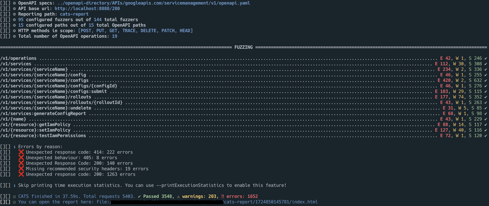
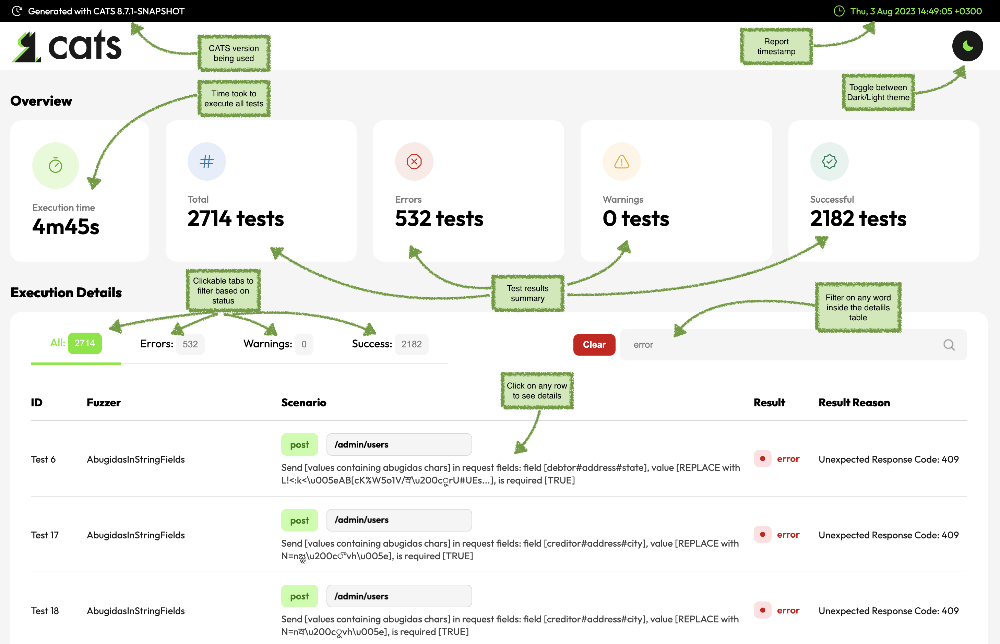

<h1 align="center">
  CATS
</h1>

<h4 align="center">
  Generate and run thousands of self-healing API tests within minutes!
</h4>

<div align="center">
  
</div>


[](https://sonarcloud.io/dashboard?id=cats)
[](https://sonarcloud.io/dashboard?id=cats)
[](https://sonarcloud.io/dashboard?id=cats)
[](https://sonarcloud.io/dashboard?id=cats)
[](https://sonarcloud.io/dashboard?id=cats)
[](https://sonarcloud.io/dashboard?id=cats)
[](https://sonarcloud.io/dashboard?id=cats)

# Overview
By using a simple and minimal syntax, with a flat learning curve, CATS enables you to generate hundreds of API tests within seconds with **no coding effort**. All test cases are **generated and run automatically** based on a pre-defined 
set of **76 Fuzzers**. The Fuzzers cover different types of testing like: negative testing, boundary testing, structural validations and security. 
Even more, you can leverage the fact that CATS generates request payloads dynamically and write simple end-to-end functional flows.

<div align="center">
  
</div>

<h3 align="center" style="color:orange">
 Starting with version 6.0, CATS generates significantly more test cases (more than 10k even for small APIs) which result in increased running times and bigger reports. 

Please check the <a href="#slicint-strategies">Slicing Strategies</a> section for options on how to split the Fuzzers.
</h3>

# Contract driven Auto-generated Tests for Swagger
Automation testing is cool, but what if you could automate testers? More specifically, what if you could automate **the entire** process of writing test cases, getting test data, writing the automation tests and then running them?  This is what CATS does.

CATS is a tool that **generates tests at runtime** based on a given **OpenAPI** contract. It will also automatically run those tests against a given service instance to check if the API has been implemented in accordance with its contract. Think of it as a tool that **eliminates the boring testing** activities from contract and API testing, allowing you to **focus on creative exploratory scenarios**.

The tests are generated based on configured `Fuzzer`s. Each `Fuzzer` will test several scenarios and report the resulting behaviour in both the console and in the generated test report.

The following logging levels are used (in both the console, and the test report) to report the testing activity:

- `INFO`/`SUCCESS` will report normal documented behaviour. This is expected behaviour. No need for action.
- `WARN` will report normal but undocumented behaviour or some misalignment between the contract and the service. This will **ideally** be actioned.
- `ERROR` will report abnormal/unexpected behaviour. This **must** be actioned.


# How the Fuzzing works
CATS will iterate through **all endpoints**, **all HTTP methods** and **all the associated requests bodies and parameters** (including multiple combinations when dealing with `oneOf`/`anyOf` elements) and fuzz their data models fields values according to their defined data type and constraints. The actual fuzzing depends on the specific `Fuzzer` executed. Please see the list of fuzzers and their behaviour.
There are also differences on how the fuzzing works depending on the HTTP method:

- for methods with request bodies like **POST, PUT** the fuzzing will be applied at the **request body data models level**
- for methods without request bodies like **GET, DELETE** the fuzzing will be applied at the **URL parameters level**

This means that for methods with request bodies (`POST,PUT`) that have also URL/path parameters, you need to supply the `path` parameters via `urlParams` or the `referenceData` file as failure to do so will result in `Illegal character in path at index ...` errors. 

# Tutorials on how to use CATS
This is a list of articles with step-by-step guides on how to use CATS:
* [Testing the GitHub API with CATS](https://ludovicianul.github.io/2020/10/05/github-api-testing/)
* [How to write self-healing functional tests with no coding effort](https://ludovicianul.github.io/2020/09/09/cats/)

# Build

You can build CATS from sources on you local box. You just need Java 11+. Maven is already bundled.

**Before running the first build, please make sure you do a `./mvnw clean`. CATS uses a fork ok `OKHttpClient` which will install locally
under the `4.9.1-CATS` version, so don't worry about any overriding of official versions.**

You can use the following Maven command to build the project:

`./mvnw clean package`

This will output a `cats.jar` file in the current directory. The file is an executable JAR that will run in Linux environments. Just run `chmod +x cats.jar` to make the file executable.

**Note:** You will need to configure Maven with a [Github PAT](https://docs.github.com/en/free-pro-team@latest/packages/guides/configuring-apache-maven-for-use-with-github-packages) with `read-packages` scope to get some dependencies for the build.

## Notes on Unit Tests

You may see some `ERROR` log messages while running the Unit Tests. Those are expected behaviour for testing the negative scenarios of the `Fuzzers`.

# Slicing Strategies for Running Cats

CATS has a significant number of `Fuzzers`. Currently, **76** and growing. Some of the `Fuzzers` are executing multiple test cases for every given field within the request.
For example the `ControlCharsOnlyInFieldsFuzzer` has **63** control chars values that will be tried for each request field. If a request has 15 fields for example, this will result in **1020 test cases**.
Considering that there are additional `Fuzzers` with the same magnitude of test cases being generated, you can easily get to 20k test cases being executed on a typical run. This will result in huge reports and long run times (i.e. minutes, rather than seconds).

Below are some recommended strategies on how you can separate the tests in chunks which can be executed as stages in a deployment pipeline, one after the other.

## Split by Endpoints
You can use the `--paths=PATH` argument to run CATS sequentially for each path.

## Split by Fuzzer Category
You can use the `--checkXXX` arguments to run CATS only with specific `Fuzzers` like: `--checkHttp`, `-checkFields`, etc.

## Split by Fuzzer Type
You can use various arguments like `--fuzers=XXX` or `-skipFuzzer=XXX` to either include or exclude specific `Fuzzers`. 
For example, you can run all `Fuzzers` except for the `ControlChars` and `Whitespaces` ones like this: `--skipFuzzers=ControlChars,Whitesspaces`. This will skip all Fuzzers containing these strings in their name.
After, you can create an additional run only with these `Fuzzers`: `--fuzzers=ControlChars,Whitespaces`.


These are just some recommendations on how you can split the types of tests cases. Depending on how complex your API is, you might go with a combination of the above or with even more granular splits.

# Available Commands
To list all available commands, run CATS with no arguments:
`./cats.jar` 

Other ways to get help from the CATS command are as follows:

- `./cats.jar help` will list all available options

- `./cats.jar version` will display the current CATS version

- `./cats.jar list fuzzers` will list all the existing fuzzers, grouped on categories

- `./cats.jar list fieldsFuzzingStrategy` will list all the available fields fuzzing strategies

- `./cats.jar list paths --contract=CONTRACT` will list all the paths available within the contract

# Running CATS with Fuzzers
A minimal run must provide the Swagger/OpenAPI contract, and the URL address of the service:

`./cats.jar --contract=mycontract.yml --server=https://localhost:8080`

But there are multiple other arguments you can supply. More details in the [available arguments](#available-arguments) section.

## Notes on skipped Tests
You may notice a significant number of tests marked as `skipped`. CATS will try to apply all `Fuzzers` to all fields, but this is not always possible.
For example the `BooleanFieldsFuzzer` cannot be applied to `String` fields. This is why that test attempt will be marked as skipped.
It was an intentional decision to report also the `skipped` tests in order to show that CATS actually tries all the `Fuzzers` on all the fields/paths/endpoints.

# Interpreting Results
After you run it, CATS will produce an execution report in a folder called `cats-report/TIMESTAMP` or `cats-report` depending on the `--timestampReports` argument. The folder will be created inside the current folder (if it doesn't exist) and for each run a new subfolder will be 
created with the `TIMESTAMP` value when the run started. This allows you to have a history of the runs. The report itself is in the `index.html` file, which will contain the following details:

- filter test runs based on the result: `All`, `Success`, `Warn` and `Error`
- filter based on the `Fuzzer` so that you can only see the runs for that specific `Fuzzer`
- a summary table with all the test cases with their corresponding path against they were run, and the result
- ability to click on any test case and get details about the Scenario being executed, Expected Result, Actual result as well as request/response details

Understanding the `Result Reason` values:
- `Unexpected Exception` - reported as `error`; this might indicate a possible bug in the service or a corner case that is not handled correctly by CATS
- `Not Matching Response Schema` - reported as a `warn`; this indicates that the service returns an expected response code and a response body, but the response body does not match the schema defined in the contract
- `Undocumented Response Code` - reported as a `warn`; this indicates that the service returns an expected response code, but the response code is not documented in the contract
- `Unexpected Response Code` - reported as an `error`; this indicates a possible bug in the service - the response code is documented, but is not expected for this scenario
- `Unexpected Behaviour` - reported as an `error`; this indicates a possible bug in the service - the response code is neither documented nor expected for this scenario
- `Not Found` - reported as an `error` in order to force providing more context; this indicates that CATS needs additional business context in order to run successfully - you can do this using the `--refData` and/or `--urlParams` arguments

This is the summary page:


And this is what you get when you click on a specific test:


# Ignoring Specific HTTP Result Codes
By default, CATS will report `WARNs` and `ERRORs` according to the specific behaviour of each Fuzzer. There are cases though when you might want to focus only on critical bugs.
You can use the `--ignoreResponseCodes` argument to supply a list of result codes that should be ignored as issues (overriding the Fuzzer behaviour) and report those cases as success instead or `WARN` or `ERROR`.
For example, if you want CATS to report `ERRORs` only when there is an Exception or the service returns a `500`, you can use this: `--ignoreResultCodes="2xx,4xx"`.

# Available arguments
- `--contract=LOCATION_OF_THE_CONTRACT` supplies the location of the OpenApi or Swagger contract.
- `--server=URL` supplies the URL of the service implementing the contract.
- `--basicauth=USR:PWD` supplies a `username:password` pair, in case the service uses basic auth.
- `--fuzzers=LIST_OF_FUZZERS` supplies a comma separated list of fuzzers. The supplied list of Fuzzers can be partial names, not full Fuzzer names. CATS which check for all Fuzzers containing the supplied strings. If the argument is not supplied, all fuzzers will be run.
- `--log=PACKAGE:LEVEL` can configure custom log level for a given package. You can provide a comma separated list of packages and levels. This is helpful when you want to see full HTTP traffic: `--log=org.apache.http.wire:debug` or suppress CATS logging: `--log=com.endava.cats:warn`
- `--paths=PATH_LIST` supplies a comma separated list of OpenApi paths to be tested. If no path is supplied, all paths will be considered.
- `--skipPaths=PATH_LIST` a comma separated list of paths to ignore. If no path is supplied, no path will be ignored
- `--fieldsFuzzingStrategy=STRATEGY` specifies which strategy will be used for field fuzzing. Available strategies are `ONEBYONE`, `SIZE` and `POWERSET`. More information on field fuzzing can be found in the sections below.
- `--maxFieldsToRemove=NUMBER` specifies the maximum number of fields to be removed when using the `SIZE` fields fuzzing strategy.
- `--refData=FILE` specifies the file containing static reference data which must be fixed in order to have valid business requests. This is a YAML file. It is explained further in the sections below.
- `--headers=FILE` specifies a file containing headers that will be added when sending payloads to the endpoints. You can use this option to add oauth/JWT tokens for example.
- `--edgeSpacesStrategy=STRATEGY` specifies how to expect the server to behave when sending trailing and prefix spaces within fields. Possible values are `trimAndValidate` and `validateAndTrim`. 
- `--sanitizationStrategy=STRATEGY` specifies how to expect the server to behave when sending Unicode Control Chars and Unicode Other Symbols within the fields. Possible values are `sanitizeAndValidate` and `validateAndSanitize`
- `--urlParams` A comma separated list of 'name:value' pairs of parameters to be replaced inside the URLs. This is useful when you have static parameters in URLs (like 'version' for example).
- `--customFuzzerFile` a file used by the `CustomFuzzer` that will be used to create user-supplied payloads.
- `--skipXXXForPath=path1,path2` can configure a fuzzer to be skipped for the specified paths. You must provide a full `Fuzzer` name instead of `XXX`. For example: `--skipVeryLargeStringsFuzzerForPath=/path1,/path2`
- `--skipFuzzers=LIST_OF_FIZZERs` a comma separated list of fuzzers that will be skipped for **all** paths. You can either provide full `Fuzzer` names (for example: `--skippedFuzzers=VeryLargeStringsFuzzer`) or partial `Fuzzer` names (for example: `--skipFuzzers=VeryLarge`). `CATS` will check if the `Fuzzer` names contains the string you provide in the arguments value.
- `--skipFields=field1,field2#subField1` a comma separated list of fields that will be skipped by replacement Fuzzers like EmptyStringsInFields, NullValuesInFields, etc.
- `--httpMethods=PUT,POST,etc` a comma separated list of HTTP methods that will be used to filter which http methods will be executed for each path within the contract
- `--securityFuzzerFile` A file used by the `SecurityFuzzer` that will be used to inject special strings in order to exploit possible vulnerabilities
- `--printExecutionStatistics` If supplied (no value needed), prints a summary of execution times for each endpoint and HTTP method
- `--timestampReports` If supplied (no value needed), it will output the report still inside the `cats-report` folder, but in a sub-folder with the current timestamp
- `--reportFormat=FORMAT` Specifies the format of the CATS report. You can use `htmlOnly` if you want the report to not contain any Javascript. This is useful in CI environments due to Javascript content security policies. Default is `htmlJs` which is the original CATS single page report format.
- `--useExamples` If `true` (default value when not supplied) then CATS will use examples supplied in the OpenAPI contact. If `false` CATS will rely only on generated values
- `--checkFields` If supplied (no value needed), it will only run the Field Fuzzers
- `--checkHeaders` If supplied (no value needed), it will only run the Header Fuzzers
- `--checkHttp` If supplied (no value needed), it will only run the HTTP Fuzzers
- `--checkContract` If supplied (no value needed), it will only run the ContractInfo Fuzzers 
- `--sslKeystore` Location of the JKS keystore holding certificates used when authenticating calls using one-way or two-way SSL 
- `--sslKeystorePwd` The password of the `sslKeystore`
- `--sslKeyPwd` The password of the private key from the `sslKeystore`
- `--proxyHost` The proxy server's host name (if running behind proxy)
- `--proxyPort` The proxy server's port number (if running behind proxy)
- `--maxRequestsPerMinute` Maximum number of requests per minute; this is useful when APIs have rate limiting implemented; default is 10000
- `--connectionTimeout` Time period in seconds which CATS should establish a connection with the server; default is 10 seconds
- `--writeTimeout` Maximum time of inactivity in seconds between two data packets when sending the request to the server; default is 10 seconds
- `--readTimeout` Maximum time of inactivity in seconds between two data packets when waiting for the server's response; default is 10 seconds
- `--dryRun` If provided, it will simulate a run of the service with the supplied configuration. The run won't produce a report, but will show how many tests will be generated and run for each OpenAPI endpoint
- `--ignoreResponseCodes` HTTP_CODES_LIST a comma separated list of HTTP response codes that will be considered as SUCCESS, even if the Fuzzer will typically report it as WARN or ERROR. You can use response code families as `2xx`, `4xx`, etc. **If provided, all Contract Fuzzers will be skipped**.

Using some of these options a typical invocation of CATS might look like this:

`./cats.jar --contract=my.yml --server=https://locathost:8080 --checkHeaders`

This will run CATS against `http://localhost:8080` using `my.yml` as an API spec and will only run the HTTP headers `Fuzzers`.

# Available Fuzzers
To get a list of fuzzers run `./cats.jar list fuzzers`. A list of all available fuzzers will be returned, along with a short description for each.

There are multiple categories of `Fuzzers` available:

- `Field Fuzzers` which target request body fields or path parameters
- `Header Fuzzers` which target HTTP headers
- `HTTP Fuzzers` which target just the interaction with the service (without fuzzing fields or headers)

Additional checks which are not actually using any fuzzing, but leverage the CATS internal model of running the test cases as `Fuzzers`:

- `ContractInfo Fuzzers` which checks the contract for API good practices
- `Special Fuzzers` a special category which need further configuration and are focused on more complex activities like functional flow or security testing

## Field Fuzzers
`CATS` has currently 40 registered Field `Fuzzers`:
- `BooleanFieldsFuzzer` - iterate through each Boolean field and send random strings in the targeted field
- `DecimalFieldsLeftBoundaryFuzzer` - iterate through each Number field (either float or double) and send requests with outside the range values on the left side in the targeted field
- `DecimalFieldsRightBoundaryFuzzer` - iterate through each Number field (either float or double) and send requests with outside the range values on the right side in the targeted field
- `DecimalValuesInIntegerFieldsFuzzer` - iterate through each Integer field and send requests with decimal values in the targeted field
- `EmptyStringValuesInFieldsFuzzer` - iterate through each field and send requests with empty String values in the targeted field
- `ExtremeNegativeValueDecimalFieldsFuzzer` - iterate through each Number field and send requests with the lowest value possible (-999999999999999999999999999999999999999999.99999999999 for no format, -3.4028235E38 for float and -1.7976931348623157E308 for double) in the targeted field
- `ExtremeNegativeValueIntegerFieldsFuzzer` - iterate through each Integer field and send requests with the lowest value possible (-9223372036854775808 for int32 and -18446744073709551616 for int64) in the targeted field
- `ExtremePositiveValueDecimalFieldsFuzzer` - iterate through each Number field and send requests with the highest value possible (999999999999999999999999999999999999999999.99999999999 for no format, 3.4028235E38 for float and 1.7976931348623157E308 for double) in the targeted field
- `ExtremePositiveValueInIntegerFieldsFuzzer` - iterate through each Integer field and send requests with the highest value possible (9223372036854775807 for int32 and 18446744073709551614 for int64) in the targeted field
- `IntegerFieldsLeftBoundaryFuzzer` - iterate through each Integer field and send requests with outside the range values on the left side in the targeted field
- `IntegerFieldsRightBoundaryFuzzer` - iterate through each Integer field and send requests with outside the range values on the right side in the targeted field
- `InvalidValuesInEnumsFieldsFuzzer` - iterate through each ENUM field and send invalid values
- `LeadingWhitespacesInFieldsTrimValidateFuzzer` - iterate through each field and send requests with Unicode whitespaces and invisible separators prefixing the current value in the targeted field
- `LeadingControlCharsInFieldsTrimValidateFuzzer` - iterate through each field and send requests with Unicode control chars prefixing the current value in the targeted field
- `LeadingSingleCodePointEmojisInFieldsTrimValidateFuzzer` - iterate through each field and send values prefixed with single code points emojis
- `LeadingMultiCodePointEmojisInFieldsTrimValidateFuzzer` - iterate through each field and send values prefixed with multi code points emojis
- `MaxLengthExactValuesInStringFieldsFuzzer` - iterate through each **String** fields that have maxLength declared and send requests with values matching the maxLength size/value in the targeted field
- `MaximumExactValuesInNumericFieldsFuzzer` - iterate through each **Number and Integer** fields that have maximum declared and send requests with values matching the maximum size/value in the targeted field
- `MinLengthExactValuesInStringFieldsFuzzer` - iterate through each **String** fields that have minLength declared and send requests with values matching the minLength size/value in the targeted field
- `MinimumExactValuesInNumericFieldsFuzzer` - iterate through each **Number and Integer** fields that have minimum declared and send requests with values matching the minimum size/value in the targeted field
- `NewFieldsFuzzer` - send a 'happy' flow request and add a new field inside the request called 'catsFuzzyField'
- `NullValuesInFieldsFuzzer` - iterate through each field and send requests with null values in the targeted field
- `OnlyControlCharsInFieldsTrimValidateFuzzer` - iterate through each field and send  values with control chars only
- `OnlyWhitespacesInFieldsTrimValidateFuzzer` - iterate through each field and send  values with unicode separators only
- `OnlySingleCodePointEmojisInFieldsTrimValidateFuzzer` - iterate through each field and send  values with single code point emojis only
- `OnlyMultiCodePointEmojisInFieldsTrimValidateFuzzer` - iterate through each field and send  values with multi code point emojis only
- `RemoveFieldsFuzzer` - iterate through each request fields and remove certain fields according to the supplied 'fieldsFuzzingStrategy'
- `StringFieldsLeftBoundaryFuzzer` - iterate through each String field and send requests with outside the range values on the left side in the targeted field
- `StringFieldsRightBoundaryFuzzer` - iterate through each String field and send requests with outside the range values on the right side in the targeted field
- `StringFormatAlmostValidValuesFuzzer` - iterate through each String field and get its 'format' value (i.e. email, ip, uuid, date, datetime, etc); send requests with values which are almost valid (i.e. email@yhoo. for email, 888.1.1. for ip, etc)  in the targeted field
- `StringFormatTotallyWrongValuesFuzzer` - iterate through each String field and get its 'format' value (i.e. email, ip, uuid, date, datetime, etc); send requests with values which are totally wrong (i.e. abcd for email, 1244. for ip, etc)  in the targeted field
- `StringsInNumericFieldsFuzzer` - iterate through each Integer (int, long) and Number field (float, double) and send requests having the `fuzz` string value in the targeted field
- `TrailingWhitespacesInFieldsTrimValidateFuzzer` - iterate through each field and send requests with trailing with Unicode whitespaces and invisible separators in the targeted field
- `TrailingControlCharsInFieldsTrimValidateFuzzer` - iterate through each field and send requests with trailing with Unicode control chars in the targeted field
- `TrailingSingleCodePointEmojisInFieldsTrimValidateFuzzer` - iterate through each field and send values trailed with single code point emojis
- `TrailingMultiCodePointEmojisInFieldsTrimValidateFuzzer` - iterate through each field and send values trailed with multi code point emojis
- `VeryLargeStringsFuzzer` - iterate through each String field and send requests with very large values (40000 characters) in the targeted field
- `WithinControlCharsInFieldsSanitizeValidateFuzzer` - iterate through each field and send values containing unicode control chars
- `WithinSingleCodePointEmojisInFieldsTrimValidateFuzzer` - iterate through each field and send values containing single code point emojis
- `WithinMultiCodePointEmojisInFieldsTrimValidateFuzzer` - iterate through each field and send values containing multi code point emojis

You can run only these `Fuzzers` by supplying the `--checkFields` argument.

Some of the `Fuzzers` are detailed into the next sessions.

### BooleanFieldsFuzzer
This `Fuzzer` applies only to Boolean fields. It will try to send invalid boolean values and expects a `4XX` response code.

### DecimalFieldsLeftBoundaryFuzzer and DecimalFieldsRightBoundaryFuzzer
This `Fuzzer` will run boundary tests for fields marked as `Number`, including `float` and `double` formats.  It will use the `minimum` property to generate a left boundary value or `maximum` for the right boundary one.
If any of these values are not set, it will use `Long.MIN_VALUE` and `Long.MAX_VALUE`. It expects a `4XX` response code.

### IntegerFieldsLeftBoundaryFuzzer and IntegerFieldsRightBoundaryFuzzer
This `Fuzzer` is similar to the `Decimal Fuzzers`, but for `Integer` fields, both `int32` and `int64` formats.

### ExtremeNegativeValueXXXFieldsFuzzer and ExtremePositiveValueXXXFuzzer
These `Fuzzers` apply for `Decimal` and `Integer` fields. They will send either an extremely low negative value or an extremely high positive value as follows:
- for `Decimal` fields: `-999999999999999999999999999999999999999999.99999999999`when no format is specified, and `-Float.MAX_VALUE` for `float` and `-Double.MAX_VALUE` for `double`
- for `Integer` fields: `Long.MIN_VALUE` when no format is specified or `int32`and `2 * Long.MIN_VALE` for `int64`

These `Fuzzers` expect a `4XX` response code.

### RemoveFieldsFuzzer
This `Fuzzer` will remove fields from the requests based on a supplied strategy. It will create subsets of all the fields and subfields within the request schema. Based on these subsets, it will:
- iterate through them one by one 
- remove the fields present in the current subset from a full service payload
- send the modified request to the server 

These subsets can be generated using the following strategies (supplied through the `--fieldsFuzzingStrategy` option):

#### POWERSET
This is the most time-consuming strategy. This will create all possible subsets of the request fields (including subfields). If the request contains a lot of fields, this strategy might not be the right choice as the total number of possibilities is `2^n`, where `n` is the number of fields.

For example given the request:

```json

{
    "address": {
        "phone": "123",
        "postCode": "408",
        "street": "cool street"    
    },
    "name": "john"
}

```

All the fields, including subfields will look like this: `{name, address#phone, address#postcode, address#street}`. Using the `POWERSET` strategy there are 16 possible subsets. The `FieldsFuzzer` will iterate through each set and remove those fields (and subfields) from the request. All the other headers and request fields will remain unchanged.

#### ONEBYONE
This is the faster strategy and also the **default** one. This will iterate though each request field (including subfields) and create a single element set from it. The `FieldFuzzer` will iterate though the resulting sets and remove those fields (and subfields) from the request i.e. one field at a time. All the other headers and fields will remain unchanged.

If we take the example above again, the resulting sets produced by this strategy will be as follows:

`{address#phone}, {address#postcode}, {address#street}, {name}`

#### SIZE
This is a mixed strategy. It applies principles from the `POWERSET` strategy, but will remove a maximum number of fields (and subfields) supplied though the `--maxFieldsToRemove` option. This means that will generate subsets of fields (and subfields) having size `n - maxFieldsToRemove` or greater, where `n` is the total number of fields and subfields.

If `--maxFieldsToRemove` for the example above is `2`, the resulting sets produced by this strategy will be as follows:

`
{address#phone, address#postcode, address#street}, {name, address#postcode, address#street}, {name, address#phone, address#street}, {name, address#phone, address#postcode}, {name, address#street}, {name, address#postalcode}, {name, address#phone}, {address#phone, address#postalcode}, {address#phone, address#street}, {address#postalcode, address#street}
`

Independent of the strategy used to generate the subsets of the fields that will be iteratively removed, the `Fuzzer` will behave as follows:
- Normal behaviour is for the service to respond with `4XX` in cases where required fields (or subfields) were removed and with a `2XX` code in cases where optional fields (or subfields) were removed. If the response code received is a documented one, this will be logged with an `INFO` level log message, otherwise with a `WARN` message.
- In the case when the request has at least one required field removed and the service responds with `2XX` this will be reported using an `ERROR` message.
- In the case when the request didn't have any required field (or subfield) removed and the service responds with `2XX`, this is expected behaviour and will be reported using an `INFO` level message.
- In the case when the request didn't have any required field removed, but the service responds with a `4XX` or `5XX` code, this is abnormal behaviour and will be reported as an `ERROR` message.
- Any other case is considered abnormal behaviour and will be reported as an `ERROR` message.

### StringFieldsRightBoundaryFuzzer
The max length of a String supported by the JVM APIs is `Integer.MAX_VALUE` which is `2^31-1`. 

Based on this constraint, this Fuzzer will send String values whose length are bigger than the defined `maxLength` property:
- if the `maxLength` is equal to `2^31-1`, the Fuzzer won't run as it cannot create Strings larger than this value
- if the `maxLength` is between `2^31-1 - 10` and `2^31-1 - 2`, the Fuzzer will generate Strings with a length of `2^31-1 - 2`
- if the `maxLength` is less than `2^31-1 - 10`, the Fuzzer will generate Strings with a length of `maxLength + 10`
- if no `maxLength` is defined, the Fuzzer will generate a string of `10 000` characters

**Please note that when having string properties with such high `maxLength` the probability of getting `OutOfMemoryErrors` is quite high. 
There are very few cases when this is actually needed as it will also take a long time to send such a huge payloads to the service. 
Please consider setting reasonable `maxLength` values which make sense in your business context.
Setting reasonable boundaries for your inputs is also a good practice from a security perspective and will prevent your service from crashing when dealing with large inputs.**

### StringFormatAlmostValidValuesFuzzer
OpenAPI offers the option to specify `formats` for each `string` field. This gives hints to the client on what type of data is expected by the API.
This `Fuzzer` has a predefined list of `formats`. For all `strings` matching any of the predefined `formats` it will send values which are 'almost valid' for that particular format. For example:
- if the `format` is `password` it will send the `string` `bgZD89DEkl` which is an almost valid strong password (except that it doesn't contain special characters).
- if the `format` is `email` it will send the `string` `email@bubu.` which is an almost valid email (except it doesn't contain the domain extension).
- and so on.
The following formats are supported: `byte, date, date-time, hostname, ipv4, ipv6, ip, password, uri, url, uuid`
The `Fuzzer` expects a `4XX` response code.

### StringFormatTotallyWrongValuesFuzzer
This behaves in the same way as the previous `Fuzzer`, but the values sent for each format are totally invalid (like `aaa` for `email` for example).

### NewFieldsFuzzer
This `Fuzzer` will inject new fields inside the body of the requests. The new field is called `fuzzyField`. The `Fuzzers` will behave as follows:
- Normal behaviour is for the service to return a `4XX` code for `POST`, `PUT` and `PATCH` and a `2XX` code for `GET`. If the code is documented, this will be reported as an `INFO` message, otherwise as a `WARN` message.
- If the code responds with a `2XX` or `4XX` code, depending on the previous point, this is considered abnormal behaviour and will reported as an `ERROR` message.
- Any other case is reported as an `ERROR` message.

### StringsInNumericFieldsFuzzer
This `Fuzzer` will send the `fuzz` string in every numeric fields and expect all requests to fail with `4XX`.

### LeadingWhitespacesInFieldsTrimValidateFuzzer, TrailingWhitespacesInFieldsTrimValidateFuzzer and OnlyWhitespacesInFieldsTrimValidateFuzzer
This `Fuzzers` will prefix or trail each field with Unicode whitespaces and invisible chars. 
The expected result is that the service will sanitize these values and a `2XX` response code is received. These `Fuzzers` will fuzz all fields types except for discriminator fields.
It's critical for APIs to sanitize input values as they will eventually lead to unexpected behaviour.

Please note that CATS tests iteratively for **18 whitespace characters**. This means that for **each field** within the requests CATS will run **18 test cases**.
This is why the number of tests (and time to run) CATS will increase significantly depending on the number of endpoints and request fields.
Please check the [Slicing Strategies](#slicing-strategies-for-running-cats) section on recommendations on how to split Fuzzers in batches so that you get optimal running times and reporting.   

### LeadingControlCharsInFieldsTrimValidateFuzzer, TrailingControlCharsInFieldsTrimValidateFuzzer and OnlyControlCharsInFieldsTrimValidateFuzzer
This `Fuzzers` will prefix or trail each field with Unicode control chars.
The expected result is that the service will sanitize these values and a `2XX` response code is received. These `Fuzzers` will fuzz all fields types except for discriminator fields.
It's critical for APIs to sanitize input values as they will eventually lead to unexpected behaviour.

Please note that CATS tests iteratively for **63 control characters**. This means that for **each field** within the requests CATS will run **63 test cases**.
This is why the number of tests (and time to run) CATS will increase significantly depending on the number of endpoints and request fields.
Please check the [Slicing Strategies](#slicing-strategies-for-running-cats) section on recommendations on how to split Fuzzers in batches so that you get optimal running times and reporting.

### WithinControlCharsInFieldsSanitizeValidateFuzzer
This `Fuzzers` will insert Unicode control chars within each field.

Depending on the `--sanitizationStrategy` argument, this `Fuzzer` will expect:
- `2XX` if `--sanitizationStrategy=sanitizeAndValidate`. This is also the default value (i.e. when not specifying and explicit strategy).
- `2XX` or `4XX` depending on the specific regex set for the fuzzed field when `--sanitizationStrategy=validateAndSanitize`.

These `Fuzzers` will fuzz only `String` fields.
It's critical for APIs to sanitize input values as they will eventually lead to unexpected behaviour.

Please note that CATS tests iteratively for **63 control characters**. This means that for **each field** within the requests CATS will run **63 test cases**.
This is why the number of tests (and time to run) CATS will increase significantly depending on the number of endpoints and request fields.
Please check the [Slicing Strategies](#slicing-strategies-for-running-cats) section on recommendations on how to split Fuzzers in batches so that you get optimal running times and reporting.


## Header Fuzzers
`CATS` has currently 19 registered Header `Fuzzers`: 
- `CheckSecurityHeadersFuzzer` - check all responses for good practices around Security related headers like: [{name=Cache-Control, value=no-store}, {name=X-XSS-Protection, value=1; mode=block}, {name=X-Content-Type-Options, value=nosniff}, {name=X-Frame-Options, value=DENY}]
- `DummyAcceptHeadersFuzzer` - send a request with a dummy Accept header and expect to get 406 code
- `DummyContentTypeHeadersFuzzer` - send a request with a dummy Content-Type header and expect to get 415 code
- `DuplicateHeaderFuzzer` - send a 'happy' flow request and duplicate an existing header
- `EmptyStringValuesInHeadersFuzzer` - iterate through each header and send requests with empty String values in the targeted header
- `ExtraHeaderFuzzer` - send a 'happy' flow request and add an extra field inside the request called 'Cats-Fuzzy-Header'
- `LargeValuesInHeadersFuzzer` - iterate through each header and send requests with large values in the targeted header
- `LeadingControlCharsInHeadersFuzzer` - iterate through each header and prefix values with control chars
- `LeadingWhitespacesInHeadersFuzzer` - iterate through each header and prefix value with unicode separators
- `LeadingSpacesInHeadersFuzzer` - iterate through each header and send requests with spaces prefixing the value in the targeted header
- `RemoveHeadersFuzzer` - iterate through each header and remove different combinations of them
- `OnlyControlCharsInHeadersFuzzer` - iterate through each header and replace value with control chars
- `OnlySpacesInHeadersFuzzer` - iterate through each header and replace value with spaces
- `OnlyWhitespacesInHeadersFuzzer` - iterate through each header and replace value with unicode separators
- `TrailingSpacesInHeadersFuzzer` - iterate through each header and send requests with trailing spaces in the targeted header \
- `TrailingControlCharsInHeadersFuzzer` - iterate through each header and trail values with control chars
- `TrailingWhitespacesInHeadersFuzzer` - iterate through each header and trail values with unicode separators
- `UnsupportedAcceptHeadersFuzzer` - send a request with an unsupported Accept header and expect to get 406 code
- `UnsupportedContentTypesHeadersFuzzer` - send a request with an unsupported Content-Type header and expect to get 415 code

You can run only these `Fuzzers` by supplying the `--checkHeaders` argument.

Some of the `Fuzzers` are detailed into the next sessions.

### LargeValuesInHeadersFuzzer
This `Fuzzer` will send large values in the request headers. It will iterate through each header and fuzz it with a large value. All the other headers and the request body and query string will be similar to a 'normal' request. This `Fuzzer` will behave as follows:
- Normal behaviour is for the service to respond with a `4XX` code. In case the response code is a documented one, this will be reported with an `INFO` level log message, otherwise with a `WARN` level message.
- If the service responds with a `2XX` code, the `Fuzzer` will report it as an `ERROR` level message.
- Any other case will be reported using an `ERROR` level message.

### RemoveHeadersFuzzer
This `Fuzzer` will create the power set of the headers set. It will then iterate through all those sets and remove them from the payload. The `Fuzzer` will behave as follows:
- Normal behaviour is for the service to respond with a `4XX` code in the case when required headers were removed and with a `2XX` code in the case of optional headers being removed. If the response code is a documented one, this will be reported as an `INFO` level message, otherwise as a `WARN` message.
- In the case that the request has at least one required header removed and the service responds with a `2XX` code, this will be reported as an `ERROR` message.
- In the case that the request didn't have any required headers removed and the service response is a `2XX` code, this is expected behaviour and will be reported as an `INFO` level log message.
- In the case where the request didn't have any required headers removed, but the service responded with a `4XX` or `5XX` code, this is abnormal behaviour and will be reported as an `ERROR` message.
- Any other case is considered abnormal behaviour and will be reported as an `ERROR` message.

Please note: **When the RemoveHeadersFuzzer is running any security (either named `authorization` or `jwt`) header mentioned in the `headers.yml` will be added to the requests.**

### DummyContentTypeHeadersFuzzer,  DummyAcceptHeadersFuzzer, UnsupportedTypeHeadersFuzzer, UnsupportedAcceptHeadersFuzzer
These `Fuzzers` are implementing the [OWASP REST API recommendations](https://cheatsheetseries.owasp.org/cheatsheets/REST_Security_Cheat_Sheet.html).
They check that the API has correctly set the `Content-Type` and `Accept` headers and no invalid values can be supplied.

The `Fuzzers` expect:
- `406` for unsupported or invalid `Accept` headers
- `415` for unsupported or invalid `Content-Type` headers

### CheckSecurityHeadersFuzzer
This `Fuzzer` will continue the [OWASP REST API recommendations](https://cheatsheetseries.owasp.org/cheatsheets/REST_Security_Cheat_Sheet.html) by checking
a list of required Security headers that must be supplied in each response. 

The `Fuzzer` expects a `2XX` response with the following headers set:
- `Cache-Control: no-store`
- `X-Content-Type-Options: nosniff`
- `X-Frame-Options: DENY`
- `X-XSS-Protection: 1; mode=block`

## HTTP Fuzzers
`CATS` has currently 6 registered HTTP `Fuzzers`:
- `BypassAuthenticationFuzzer` - check if an authentication header is supplied; if yes try to make requests without it
- `DummyRequestFuzzer` - send a dummy json request {'cats': 'cats'}
- `HappyFuzzer` - send a request with all fields and headers populated
- `HttpMethodsFuzzer` - iterate through each undocumented HTTP method and send an empty request
- `MalformedJsonFuzzer` - send a malformed json request which has the String 'bla' at the end
- `NonRestHttpMethodsFuzzer` - iterate through a list of HTTP method specific to the WebDav protocol that are not expected to be implemented by REST APIs

You can run only these `Fuzzers` by supplying the `--checkHttp` argument.

Some of the `Fuzzers` are detailed into the next sessions.

### HappyFuzzer
This `Fuzzer` will send a full request to the service, including all fields and headers. The `Fuzzer` will behave as follows:
- Normal behaviour is for the service to return a `2XX` code. This will be reported as an `INFO` message if it's a documented code or as a `WARN` message otherwise.
- Any other case is considered abnormal behaviour and will be reported as an `ERROR` message.

### HttpMethodsFuzzer
This `Fuzzer` will set the http request for any unspecified HTTP method in the contract. The `Fuzzer` will behave as follows:
- Normal behaviour is for the service to respond with a `405` code if the method is not documented in the contract. This is reported as an level `INFO` message.
- If the service responds with a `2XX` code this is considered abnormal behaviour and will be reported as an `ERROR` message.
- Any other case is reported as a `WARN` level message.

### BypassAuthenticationFuzzer
This `Fuzzer` will try to send 'happy' flow requests, but will omit any supplied header which might be used for authentication like: `Authorization` or headers containing `JWT`.
The expected result is a `401` or `403` response code.

### MalformedJsonFuzzer
This `Fuzzer` will send a malformed JSON to the service and expects a validation error. The malformed JSON is obtained by taking a valid JSON from the `HappyFuzzer` and append the word `bla` at the end.  

**Please note that because the CATS report will only display valid JSON files for both request and responses, the final report won't display the malformed JSON which includes the `bla` string at the end.
No need to worry, as CATS is actually sending the right malformed data to the service. You can check the running logs for the line starting with `Final payload:` to see the exact string which is being send to the service.**


## ContractInfo Fuzzers
Usually a good OpenAPI contract must follow several good practices in order to make it easy digestible by the service clients and act as much as possible as self-sufficient documentation:
- follow good practices around naming the contract elements like paths, requests, responses
- always use plural for the path names, separate paths words through hyphens/underscores, use camelCase or snake_case for any `json` types and properties
- provide tags for all operations in order to avoid breaking code generation on some languages and have a logical grouping of the API operations
- provide good description for all paths, methods and request/response elements
- provide meaningful responses for `POST`, `PATCH` and `PUT` requests
- provide examples for all requests/response elements
- provide structural constraints for (ideally) all request/response properties (min, max, regex)
- heaver some sort of `CorrelationIds/TraceIds` within headers
- have at least a security schema in place
- avoid having the API version part of the paths
- document response codes for both "happy" and "unhappy" flows
- avoid using `xml` payload unless there is a really good reason (like documenting an old API for example)
- json types and properties do not use the same naming (like having a `Pet` with a property named `pet`)

`CATS` has currently 9 registered ContractInfo `Fuzzers`:
- `HttpStatusCodeInValidRangeFuzzer` -  verifies that all HTTP response codes are within the range of 100 to 599
- `NamingsContractInfoFuzzer` - verifies that all OpenAPI contract elements follow REST API naming good practices
- `PathTagsContractInfoFuzzer` - verifies that all OpenAPI paths contain tags elements and checks if the tags elements match the ones declared at the top level
- `RecommendedHeadersContractInfoFuzzer` - verifies that all OpenAPI contract paths contain recommended headers like: CorrelationId/TraceId, etc.
- `RecommendedHttpCodesContractInfoFuzzer` - verifies that the current path contains all recommended HTTP response codes for all operations
- `SecuritySchemesContractInfoFuzzer` - verifies if the OpenApi contract contains valid security schemas for all paths, either globally configured or per path
- `TopLevelElementsContractInfoFuzzer` - verifies that all OpenAPI contract level elements are present and provide meaningful information: API description, documentation, title, version, etc.
- `VersionsContractInfoFuzzer` - verifies that a given path doesn't contain versioning information
- `XmlContentTypeContractInfoFuzzer` - verifies that all OpenAPI contract paths responses and requests does not offer `application/xml` as a Content-Type

You can run only these `Fuzzers` by supplying the `--checkContract` argument.


## Special Fuzzers
### CustomFuzzer
#### Writing Custom Tests
In some cases, the tests generated by CATS will not be sufficient for your situation. 
Using the `CustomFuzzer` you can leverage the full power if CATS on not writing any code, while also supply custom values for specific fields. 
The cool thing is that you can target a single field, and the rest of the information will be populated by `CATS` using valid data, just like a 'happy' flow request.
**It's important to note that `reference data` won't get replaced when using the `CustomFuzzer`. So if there are reference data fields, you must also supply those in the `CustomFuzzer`.**
The `CustomFuzzer` will only trigger if a valid `customFuzzer.yml` file is supplied. The file has the following syntax:

```yaml
/path:
    testNumber:
        description: Short description of the test case
        prop: value
        prop#subprop: value
        prop7:
          - value1
          - value2
          - value3
        oneOfSelection:
          element#type: "Value"
        expectedResponseCode: HTTP_CODE
        httpMethod: HTTP_NETHOD
```

This is a description of the elements within the `customFuzzer.yml` file:
- you can supply a `description` of the test case. This will be set as the `Scenario` description. If you don't supply a `description` the `testNumber` will be used instead.
- you can have multiple tests under the same path: `test1`, `test2`, etc.
- `expectedResponseCode` is mandatory, otherwise the `Fuzzer` will ignore this test. The `expectedResponseCode` tells CATS what to expect from the service when sending this test.
- *at most* one of the properties can have multiple values. When this situation happens, that test will actually become a list of tests one for each of the values supplied. For example in the above example `prop7` has 3 values. This will actually result in 3 tests, one for each value.
- `CustomFuzzer` only triggers when you supply a `customFuzzer.yml`-like file using the `--customFuzzerFile=XXX` argument.
- test within the file are executed **in the declared order**. This is why you can have outputs from one test act as inputs for the next one(s) (see the next section for details).
- if the supplied `httpMethod` doesn't exist in the OpenAPI given path, a `warning` will be issued and no test will be executed
- if the supplied `httpMethod` is not a valid HTTP method, a `warning` will be issued and no test will be executed
- if the request payload uses a `oneOf` element to allow multiple request types, you can control which of the possible types the `CustomFuzzer` will apply to using the `oneOfSelection` keyword. The value of the `oneOfSelection` keyword must match the fully qualified name of the `discriminator`.
- if no `oneOfSelection` is supplied, and the request payload accepts multiple `oneOf` elements, than a custom test will be created for each type of payload
- the file uses [Json path](https://github.com/json-path/JsonPath) syntax for all the properties you can supply; you can separate elements through `#` as in the example above instead of `.`

#### Dealing with oneOf, anyOf
When you have request payloads which can take multiple object types, you can use the `oneOfSelection` keyword to specify which of the possible object types is required by the `CustomFuzzer`.
If you don't provide this element, all combinations will be considered. If you supply a value, **this must be exactly the one used in the `discriminator`.**

#### Correlating Tests
As CATs mostly relies on generated data with small help from some reference data, testing complex business scenarios with the pre-defined `Fuzzers` is not possible. Suppose we have an endpoint that creates data (doing a `POST`), and we want to check its existence (via `GET`).
We need a way to get some identifier from the POST call and send it to the GET call. This is now possible using the `CustomFuzzer`.
The `customFuzzerFile` can have an `output` entry where you can state a variable name, and its fully qualified name from the response in order to set its value. 
You can then refer the variable using `${variable_name}` from another test case in order to use its value. 

Here is an example:
```yaml
/pet:
    test_1:
      description: Create a Pet
      httpMethod: POST
      name: "My Pet"
      expectedResponseCode: 200
      output:
        petId: pet#id
/pet/{id}:
    test_2:
      description: Get a Pet
      id: ${petId}
      expectedResponseCode: 200
```

Suppose the `test_1` execution outputs:

```json
{
  "pet": 
    { 
      "id" : 2
    }
}
```

When executing `test_1` the value of the pet id will be stored in the `petId` variable (value `2`).
When executing `test_2` the `id` parameter will be replaced with the `petId` variable (value `2`) from the previous case.

**Please note: variables are visible across all custom tests; please be careful with the naming as they will get overridden.**

#### Verifying responses
The `CustomFuzzer` can verify more than just the `expectedResponseCode`. This is achieved using the `verify` element. This is an extended version of the above `customFuzzer.yml` file.  

```yaml
/pet:
    test_1:
      description: Create a Pet
      httpMethod: POST
      name: "My Pet"
      expectedResponseCode: 200
      output:
        petId: pet#id
      verify:
        pet#name: "Baby"
        pet#id: "[0-9]+"
/pet/{id}:
    test_2:
      description: Get a Pet
      id: ${petId}
      expectedResponseCode: 200
```

Considering the above file:
- the `CustomFuzzer` will check if the response has the 2 elements `pet#name` and `pet#id` 
- if the elements are found, it will check that the `pet#name` has the `Baby` value and that the `pet#id` is numeric

The following json response will pass `test_1`:
```json
{
  "pet": 
    { 
      "id" : 2,
      "name": "Baby"
    }
}
```

But this one won't (`pet#name` is missing):
```json
{
  "pet": 
    { 
      "id" : 2
    }
}
```

You can also refer to request fields in the `verify` section by using the `request.` qualifier. Using the above example, by having the following `verify` section:

```yaml
/pet:
  test_1:
    description: Create a Pet
    httpMethod: POST
    name: "My Pet"
    expectedResponseCode: 200
    output:
      petId: pet#id
    verify:
      pet#name: "request#name"
      pet#id: "[0-9]+"
```

It will verify if the response contains a `pet#name` element and that its value equals `My Pet` as sent in the request.

Some notes:
- `verify` parameters support Java regexes as values
- you can supply more than one parameter to check (as seen above)
- if at least one of the parameters is not present in the response, `CATs` will report an error
- if all parameters are found and have valid values, but the response code is not matched, `CATs` will report a warning
- if all the parameters are found and match their values, and the response code is as expected, `CATs` will report a success

#### Working with additionalProperties in CustomFuzzer
You can also set `additionalProperties` fields through the `customFuzzerFile` using the same syntax as for [Setting additionalProperties in Reference Data](#setting-additionalproperties).

#### CustomFuzzer Reserved keywords
The following keywords are reserved in `CustomFuzzer` tests: `output`, `expectedResponseCode`, `httpMethod`, `description`, `oneOfSelection`, `verify`, `additionalProperties`, `topElement` and `mapValues`.

### Security Fuzzer
Although `CATs` is not a security testing tool, you can use it to test basic security scenarios by fuzzing specific fields with different sets of [nasty strings](https://github.com/minimaxir/big-list-of-naughty-strings).
The behaviour is similar to the `CustomFuzzer`. You can use the exact same elements for output variables, test correlation, verify responses and so forth, with the addition that you must also specify a `targetFields` and a `stringsList` element.
A typical `securityFuzzerFile` will look like this:

```yaml
/pet:
    test_1:
      description: Run XSS scenarios
      name: "My Pet"
      expectedResponseCode: 200
      targetFields:
        - pet#id
        - pet#description
      stringsFile: xss.txt
```

You can also supply `output`, `httpMethod`, `oneOfSelection` and/or `verify` (with the same behaviour as within the `CustomFuzzer`) if they are relevant to your case.

The file uses [Json path](https://github.com/json-path/JsonPath) syntax for all the properties you can supply; you can separate elements through `#` as in the example instead of `.`.

This is what the `SecurityFuzzer` will do after parsing the above `securityFuzzerFile`:
- it will add the fixed value "My Pet" to all the request for the field `name`
- for each field specified in the `targetFields` i.e. `pet#id` and `pet#description` it will create requests for each line from the `xss.txt` file and supply those values in each field
- if you consider the `xss.txt` sample file included in the `CATs` repo, this means that it will send 21 requests targeting `pet#id` and 21 requests targeting `pet#description` i.e. a total of **42 tests**
- for each of these 42 tests, the `SecurityFuzzer` will expect a `200` response code. If another response code is returned, then `CATs` will report the test as `error`.

As an idea on how to create security tests, you can split the [nasty strings](https://github.com/minimaxir/big-list-of-naughty-strings) into multiple files of interest in your particular context.
You can have a `sql_injection.txt`, a `xss.txt`, a `command_injection.txt` and so on. For each of these files, you can create a test entry in the `securityFuzzerFile` where you include the fields you think are meaningful for these types of tests.
(It was a deliberate choice (for now) to not include all fields by default.) The `expectedResponseCode` should be tweaked according to your particular context. 
Your service might sanitize data before validation, so might be perfectly valid to expect a `200` or might validate the fields directly, so might be perfectly valid to expect a `400`.
A `500` will usually mean something was not handled properly and might signal a possible bug.

#### Working with additionalProperties in SecurityFuzzer
You can also set `additionalProperties` fields through the `customFuzzerFile` using the same syntax as for [Setting additionalProperties in Reference Data](#setting-additionalproperties).

#### SecurityFuzzer Reserved keywords
The following keywords are reserved in `SecurityFuzzer` tests: `output`, `expectedResponseCode`, `httpMethod`, `description`, `verify`, `oneOfSelection`, `targetFields`, `stringsFile`, `additionalProperties`, `topElement` and `mapValues`.


# Skipping Fuzzers for specific paths
There might be situations when you would want to skip some fuzzers for specific paths. This can be done using the `--skipXXXForPath=path1,path2` argument.
Some examples:
```bash
./cats.jar --contract=api.yml --server=http://localhost:8080 --skipVeryLargeStringsFuzzerForPath=/pet/{id},/pets
```

Running the above command will run all the fuzzers for all the paths, except for the `VeryLargeStringsFuzzer` which won't be run for the `/pet/{id}` and `/pets` paths.

You can supply multiple `--skipXXXForPath` arguments.

# Reference Data File
There are often cases where some fields need to contain relevant business values in order for a request to succeed. You can provide such values using a reference data file specified by the `--refData` argument. The reference data file is a YAML-format file that contains specific fixed values for different paths in the request document. The file structure is as follows:

```yaml
/path/0.1/auth:
    prop#subprop: 12
    prop2: 33
    prop3#subprop1#subprop2: "test"
/path/0.1/cancel:
    prop#test: 1
```

For each path you can supply custom values for properties and sub-properties which will have priority over values supplied by any other `Fuzzer`.
Consider this request payload:

```json

{
    "address": {
        "phone": "123",
        "postCode": "408",
        "street": "cool street"    
    },
    "name": "Joe"
}

```

and the following reference data file file:


```yaml
/path/0.1/auth:
    address#street: "My Street"
    name: "John"
```

This will result in any fuzzed request to the `/path/0.1/auth` endpoint being updated to contain the supplied fixed values:

```json

{
    "address": {
        "phone": "123",
        "postCode": "408",
        "street": "My Street"    
    },
    "name": "John"
}
```

The file uses [Json path](https://github.com/json-path/JsonPath) syntax for all the properties you can supply; you can separate elements through `#` as in the example above instead of `.`.

## Setting additionalProperties
As additional properties are maps i.e. they don't actually have a structure, CATS cannot currently generate valid values. If the elements within such a data structure are essential for a request,
you can supply them via the `refData` file using the following syntax:

```yaml
/path/0.1/auth:
    address#street: "My Street"
    name: "John"
    additionalProperties:
      topElement: metadata
      mapValues:
        test: "value1"
        anotherTest: "value2"
```

The `additionalProperties` element must contain the actual key-value pairs to be sent within the requests and also a top element if needed. `topElement` is not mandatory.
The above example will output the following json (considering also the above examples):
```json

{
    "address": {
        "phone": "123",
        "postCode": "408",
        "street": "My Street"    
    },
    "name": "John",
    "metadata": {
        "test": "value1",
        "anotherTest": "value2"
    }   
}
```
## RefData reserved keywords
The following keywords are reserved in a reference data file: `additionalProperties`, `topElement` and `mapValues`.

## Sending ref data for ALL paths
You can also have the ability to send the same reference data for ALL paths (just like you do with the headers). You can achieve this by using `all` as a key in the `refData` file:

```yaml
all:
  address#zip: 123
```
This will try to replace `address#zip` in **all** requests (if the field is present).

## Removing fields
There are (rare) cases when some fields may not make sense together. Something like: if you send `firstName` and `lastName`, you are not allowed to also send `name`. 
As OpenAPI does not have the capability to send request fields which are dependent on each other, you can use the `refData` file to instruct CATS to remove fields before sending a request to the service.
You can achieve this by using the `cats_remove_field` as a value for the fields you want to remove. For the above case the `refData` field will look as follows:

```yaml
all:
  name: "cats_remove_field"
```

# Headers File
This can be used to send custom fixed headers with each payload. It is useful when you have authentication tokens you want to use to authenticate the API calls. You can use path specific headers or common headers that will be added to each call using an `all` element. Specific paths will take precedence over the `all` element.
Sample headers file:

```yaml
all:
    Accept: application/json
/path/0.1/auth:
    jwt: XXXXXXXXXXXXX
/path/0.2/cancel:
    jwt: YYYYYYYYYYYYY
```

This will add the `Accept` header to all calls and the `jwt` header to the specified paths.

# Edge Spaces Strategy
There isn't a consensus on how you should handle situations when you trail or prefix valid values with spaces.
One strategy will be to have the service trimming spaces before doing the validation, while some other services will just validate them as they are.
You can control how CATS should expect such cases to be handled by the service using the `--edgeSpacesStrategy` argument. 
You can set this to `trimAndValidate` or `validateAndTrim` depending on how you expect the service to behave:
- `trimAndValidate` means that the service will first trim the spaces and after that run the validation
- `validateAndTrim` means that the service runs the validation first without any trimming of spaces

This is a **global setting** i.e. configured when CATS starts and all `Fuzzer` expects a consistent behaviour from all the service endpoints.

# URL Parameters
There are cases when certain parts of the request URL are parameterized. For example a case like: `/{version}/pets`. `{version}` is supposed to have the same value for all requests. 
This is why you can supply actual values to replace such parameters using the `--urlParams` argument.
You can supply a `;` separated list of `name:value` pairs to replace the `name` parameters with their corresponding `value`. 
For example supplying `--urlParams=version:v1.0` will replace the `version` parameter from the above example with the value `v1.0`.

# Dealing with AnyOf, AllOf and OneOf
CATS also supports schemas with `oneOf`, `allOf` and `anyOf` composition. CATS wil consider all possible combinations when creating the fuzzed payloads.

# Dynamic values in configuration files
The following configuration files: `securityFuzzerFile, customFuzzerFile, refData` support setting dynamic values for the inner fields.
For now **the support only exists** for `java.time.*` and `org.apache.commons.lang3.*`, but more types of elements will come in the near future.

Let's suppose you have a date/date-time field, and you want to set it to 10 days from now. You can do this by setting this as a value `T(java.time.OffsetDateTime).now().plusDays(10)`.
This will return an ISO compliant time in UTC format. 

A `customFuzzerFile` using this can look like:
```yaml
/path:
    testNumber:
        description: Short description of the test case
        prop: value
        prop#subprop: "T(java.time.OffsetDateTime).now().plusDays(10)"
        prop7:
          - value1
          - value2
          - value3
        oneOfSelection:
          element#type: "Value"
        expectedResponseCode: HTTP_CODE
        httpMethod: HTTP_NETHOD
```

You can also check the responses using a similar syntax and also accounting for the actual values returned in the response. This is a syntax than can test if a returned date is after the current date:
`T(java.time.LocalDate).now().isBefore(T(java.time.LocalDate).parse(expiry.toString()))`. It will check if the `expiry` field returned in the json response, parsed as date, is after the current date.

The syntax of dynamically setting dates is compliant with the [Spring Expression Language](https://docs.spring.io/spring-framework/docs/3.0.x/reference/expressions.html) specs.

# Running behind proxy
If you need to run CATS behind a proxy, you can supply the following arguments: `--proxyHost` and `--proxyPort`.
A typical run with proxy settings on `localhost:8080` will look as follows:

```bash
./cats.jar --contract=YAML_FILE --server=SERVER_URL --proxyHost=localhost --proxyPort=8080
```

# Dealing with Authentication
## HTTP header(s) based authentication
CATS supports any form of HTTP header(s) based authentication (basic auth, oauth, custom JWT, apiKey, etc) using the [headers](#headers-file) mechanism. You can supply the specific HTTP header name and value 
and apply to `all` endpoints.
Additionally, basic auth is also supported using the `--basicauth=USR:PWD` argument.

## One-Way or Two-Way SSL
By default, CATS trusts all server certificates and doesn't perform hostname verification. 

For two-way SSL you can specify a JKS file (Java Keystore) that holds the client's private key using the following arguments:  
- `--sslKeystore` Location of the JKS keystore holding certificates used when authenticating calls using one-way or two-way SSL
- `--sslKeystorePwd` The password of the `sslKeystore`
- `--sslKeyPwd` The password of the private key within the `sslKeystore`

For details on how to load the certificate and private key into a Java Keystore you can use this guide: [https://mrkandreev.name/blog/java-two-way-ssl/](https://mrkandreev.name/blog/java-two-way-ssl/).

# Limitations

## API specs
At this moment, CATS only works with OpenAPI spec.

## Media types and HTTP methods
The `Fuzzers` has the following support for media types and HTTP methods:
- `application/json` media type only
- HTTP methods: `POST`, `PUT`, `PATCH` and `GET`

## Inheritance and composition

`allOf` are supported at any object tree level. However, `anyOf` and `oneOf` are supported just at the first level within the object tree model. For example, this is a supported Object composition:

```yaml
Request:
    payload:
      oneOf:
        - $ref: '#/components/schemas/Payload1'
        - $ref: '#/components/schemas/Payload2'
      discriminator:
        propertyName: payloadType
```
However, if `Payload1` or `Payload2` will have an additional compositions, this won't be considered by CATS.

## Additional Parameters
If a response contains a free Map specified using the `additionalParameters` tag CATS will issue a `WARN` level log message as it won't be able to validate that the response matches the schema.

## Regexes within 'pattern'
CATS uses [RgxGen](https://github.com/curious-odd-man/RgxGen) in order to generate Strings based on regexes. This has certain limitations mostly with complex patterns.

# Custom Files General Info
All custom files that can be used by CATS (`customFuzzerFile`, `headers`, `refData`, etc) are in a YAML format. When setting or getting values to/from JSON for input and/or output variables, you must use a [JsonPath](https://goessner.net/articles/JsonPath/) syntax using either `#` or `.` as separators.
You can find some selector examples here: [JsonPath](https://github.com/json-path/JsonPath).

# Contributing
Please refer to [CONTRIBUTING.md](CONTRIBUTING.md).
