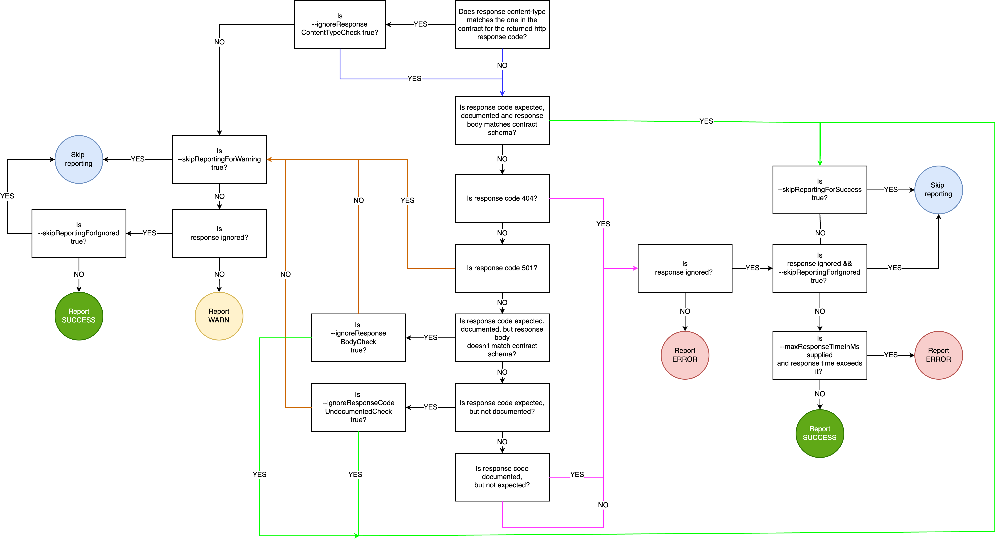

# How CATS Works

CATS generates tests based on configured Fuzzers. Each Fuzzer tests a specific scenario and has a specific expected result.
The CATS engine will run the scenario, get the result from the service and match it with the Fuzzer expectations.

Depending on the matching outcome, CATS will report as follows:

- `info`/`success` is expected and documented behaviour. No need to be actioned.
- `warn` is expected but undocumented behaviour or some misalignment between the contract and the service. This will **ideally** be actioned.
- `error` is abnormal/unexpected behaviour. This **must** be actioned.

What data goes into the report is also influenced by the arguments supplied, particularly `--ignoreXXX` arguments. 
The below diagram shows all decision points that are considered when reporting a test case:

CATS will iterate through **all endpoints**, **all HTTP methods** and **all the associated requests bodies and parameters** (including multiple combinations when dealing with `oneOf`/`anyOf` elements) 
and fuzz their values considering their defined data type and constraints.
The actual fuzzing depends on the specific Fuzzer executed. Please check the [list of fuzzers](/docs/fuzzers) for the specific behaviour.

There are also differences on how the fuzzing works depending on the HTTP method:
- for methods with request bodies like **POST, PUT, PATCH** the fuzzing will be applied at the **request body data models level**
- for methods without request bodies like **GET, DELETE** the fuzzing will be applied at the **URL parameters level**

:::note
For HTTP methods with request bodies (`POST,PUT`) that have also URL/path parameters, you need to supply the path parameters via [`--urlParams`](url-params) or the [`--refData`](reference-data-file) file 
as failure to do so will result in `Illegal character in path at index ...` errors.
:::