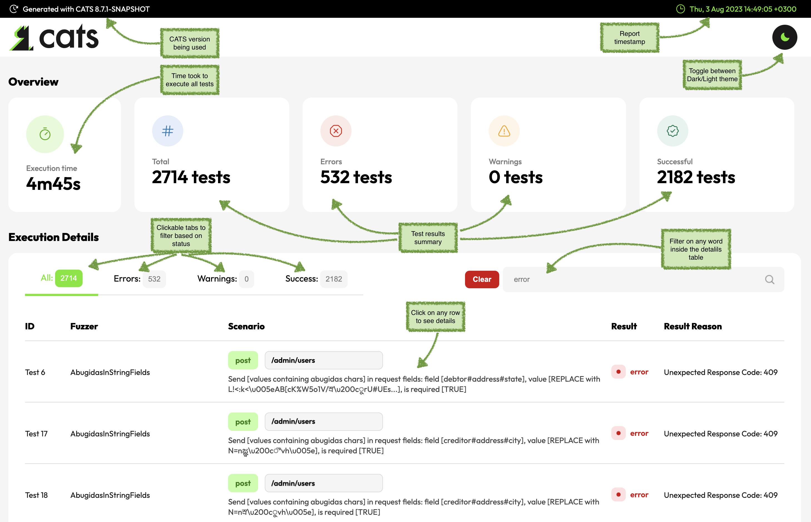
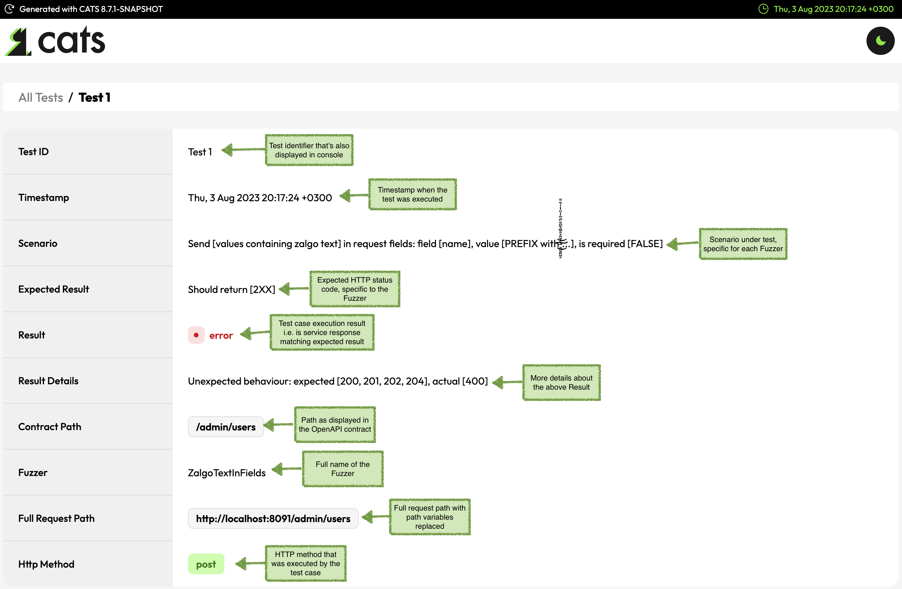
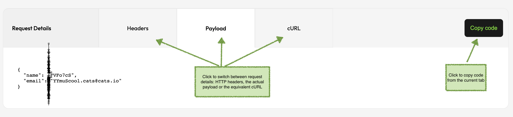

# Interpreting Results

This is a typical CATS report summary page:

## HTML_JS
`HTML_JS` is the default report produced by CATS. It has Javascript enabled in order to have some interaction with the reports.
The execution report is placed in a folder called `cats-report` which is created inside the current folder. 
Opening the `cats-report/index.html` file, you will be able to:

- filter tests based on the result: `All`, `Success`, `Warn` and `Error`
- omni-search box to be able to seach by any string without the summary table
- see summary with all the tests with their corresponding path against they were run, and the result
- have ability to click on any tests and get details about the Scenario being executed, Expected Result, Actual result as well as request/response details

:::tip
You can change `cats-report` to something else using the `-o` argument. `cats ... -o /tmp/reports` will write the CATS report in the `/tmp/reports` folder.
:::

:::note
Please note that Javascript might not play well with the CI servers. 
You may choose the non-JS version when embedding the report into a CI pipeline.
:::

Along with the summary from `index.html` each individual test will have a specific `TestXXX.html` page with more details.

:::tip
Individual tests are also written as JSON files. This is useful when you want to replay a test using `cats replay TestXXX`. 
Tests can be uploaded as test evidence and be later reproduced/verified.
:::

Understanding the `Result Reason` values:
- `Unexpected Exception` - reported as `error`; this indicates a possible bug in the service or a corner case that is not handled correctly by CATS
- `Not Matching Response Schema` - reported as a `warn`; this indicates that the service returns an expected response code and a response body, but the response body does not match the schema defined in the contract
- `Undocumented Response Code` - reported as a `warn`; this indicates that the service returns an expected response code, but the response code is not documented in the contract
- `Unexpected Response Code` - reported as an `error`; this indicates a possible bug in the service - the response code is documented, but is not expected for this scenario
- `Unexpected Behaviour` - reported as an `error`; this indicates a possible bug in the service - the response code is neither documented nor expected for this scenario
- `Not Found` - reported as an `error` in order to force providing more context; this indicates that CATS needs additional business context in order to run successfully - you can do this using the `--refData` and/or `--urlParams` arguments

This is what you get when you click on a specific test:

## HTML_ONLY
This format is similar with `HTML_JS`, but you cannot do any filtering or sorting. This is more suitable when embedding the CATS report into a CI pipeline.

## JUNIT
CATS also supports [JUNIT](https://llg.cubic.org/docs/junit/) output. The output will be a single `testsuite` that will incorporate all tests grouped by Fuzzer name.
As the JUNIT format does not have the concept of `warning` the following mapping is used:

- CATS `error` is reported as JUNIT `error`
- JUNIT `failure` is not used at all
- CATS `warn` is reported as JUNIT `skipped`
- CATS `skipped` is reported as JUNIT `disabled`

The JUNIT report is written as `junit.xml` in the `cats-report` folder. Individual tests, both as `.html` and `.json` will also be created.

:::tip
If you want to have history for CATS runs you can use the `--timestampReports` argument. This will create sub-folders for each run within the `cats-reports` folder with the corresponding timestamp.
:::
